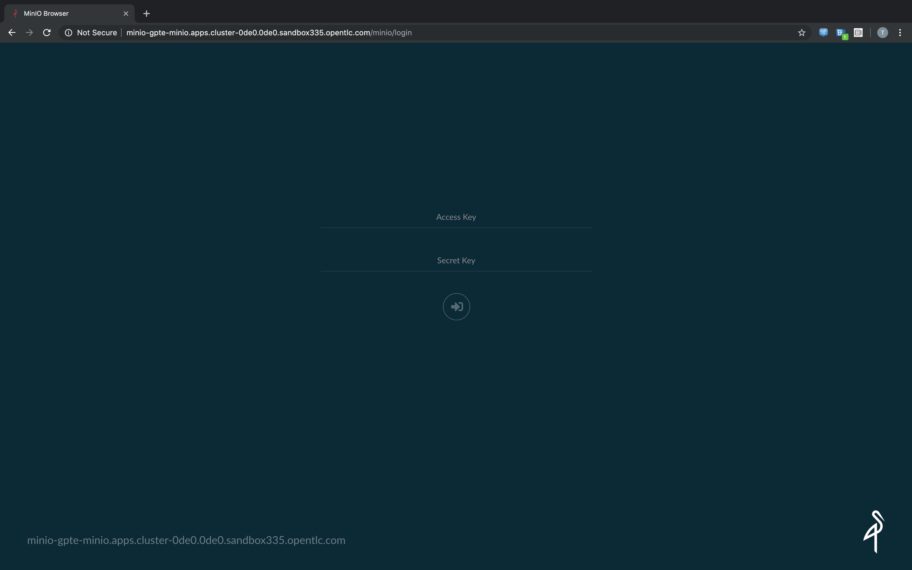
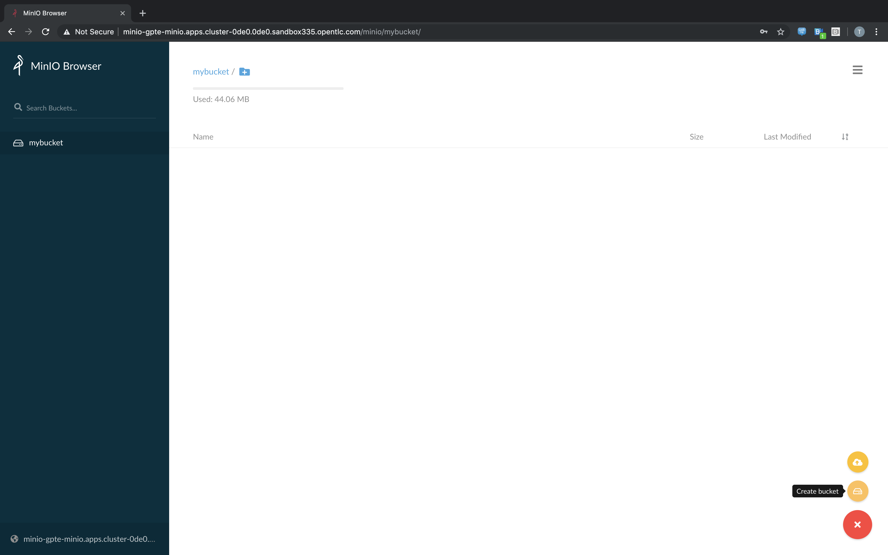

# 1.0 Prerequisites & Setup

The OpenShift Migration Operator (mig-operator) assists with installation of app migration tooling on OpenShift 3.x and 4.x clusters:

- Migration Controller (mig-controller)
- Migration UI (mig-ui)
- Velero

The above suite of tools is collectively referred to as _CAM_ (cluster app migration) in some parts of this guide.

Before using mig-operator to attempt a migration, verify that the OpenShift clusters you'll be migrating apps between meet version requirements:

| Product         | Versions    |
| -----------     | ----------- |
| OpenShift 3.x   | v3.7+       |
| OpenShift 4.x   | v4.1+       |

Note that temporary object storage will be required perform a migration:
- [AWS S3](https://aws.amazon.com/s3/)
- [Noobaa](https://www.noobaa.io/)
- [Minio](https://min.io/)

## 1.1 Base requirements

* A computer with access to the Internet :-)
* SSH client (for Microsoft Windows users [Putty](https://www.putty.org/) is recommended)
* Firefox or Chromium / Chrome
* oc client [Download from try.openshift.com](http://try.openshift.com)

## 1.4 CORS Configuration

CAM's UI is served out of the cluster
behind its own route, there are 3 distinct origins at play:

* The UI - (Ex: https://mig-ui-mig.apps.examplecluster.com)
* The OAuth Server - (Ex: https://openshift-authentication-openshift-authentication.apps.examplecluster.com)
* The API Server - (Ex: https://api.examplecluster.com:6443)

When the UI is served to the browser through it's route, the browser recognizes
its origin, and **blocks AJAX requests to alternative origins**. This is called
[Cross-Origin Resource Sharing (CORS)](https://developer.mozilla.org/en-US/docs/Web/HTTP/CORS),
and it's a deliberate browser security measure.

The full description of CORS is linked above, but without configuring the non-UI
origin servers, the requests will be blocked. To enable these requests,
the UI's origin should be whitelisted in a `corsAllowedOrigins` list for each
alternative origin. The servers should recognize this list and inspect the
origin of incoming requests. If the origin matches one of the CORS whitelisted
origins (the UI), there are a set of headers that are returned in the response
that inform the browser the CORS request is accepted and valid.

Additionally, for the same reasons described above, any requests that the UI
may make to source 3.x clusters will also have to be whitelisted by configuring
the same field in the 3.x cluster master-config.yaml. This causes the 3.x API
servers to accept the CORS requests incoming from the UI that was served out
of its OCP4 cluster's route.


## 1.5 Prepare to use mig-ui from OCP 4.1 Cluster in your Browser
1. To visit the ui, look at the route on the OCP 4.1 Cluster
```bash
$ oc get routes migration -n mig -o jsonpath='{.spec.host}'
migration-mig.apps.cluster-0de0.0de0.sandbox335.opentlc.com
```

1. For this example we'd visit the below from our browser:
  * https://migration-mig.apps.cluster-a21d.a21d.sandbox67.opentlc.com

### 1.5.1 Accept Certificates on Source and Destination Clusters

1. Before you can login you will need to accept the certificates with your
   browser on both the source and destination cluster. To do this:
  * Visit the link displayed by the webui for `.well-known/oauth-authorization-server`.
    * For example:
      * OCP 4.1: https://api.cluster-0de0.0de0.sandbox335.opentlc.com:6443/.well-known/oauth-authorization-server
      * OCP 3.11: https://master.b79f.events.opentlc.com/.well-known/oauth-authorization-server
      * OCP 3.11: https://master1.b79f.events.opentlc.com/api/v1/namespaces
  * Refresh the page
  * Get redirected to login page
1. Login with your credentials for the cluster.
  * Username: admin
  * Password: `r3dh4t1!`
1. We also need to accept the certificates from the OCP 3.11 cluster
  * Visit the webui for OCP 3.11 console, for example: https://master.b79f.events.opentlc.com
  * Login with the credentials for the cluster.
    * Username: admin
    * Password: `r3dh4t1!`

## 1.6 Object Storage Setup

CAM leverages object storage as temporary scratch space when performing migrations.  This storage can be any object storage that presents an `S3 like` interface.  Currently, we have tested AWS S3, Noobaa, and Minio.  

For purposes of this lab, we have already deployed minio on the 4.1 cluster.  Let's proceed with creating a bucket for our use:

1. Let's get the route to the Minio web UI.
```
$ oc get route -n gpte-minio
NAME    HOST/PORT                                                        PATH   SERVICES   PORT   TERMINATION   WILDCARD
minio   minio-gpte-minio.apps.cluster-0de0.0de0.sandbox335.opentlc.com          minio      9000                 None
```



2. Visit the route and login to manually create a bucket; login with Access Key: `minio` and Secret Key: `minio123`.  Any bucket name will suffice, we choose `mybucket`.




We now have a bucket created.  We will use this during our migration exercises.


Next Lab: [Lab 3 - CPMA Overview](./2.md)<br>
[Home](./README.md)
