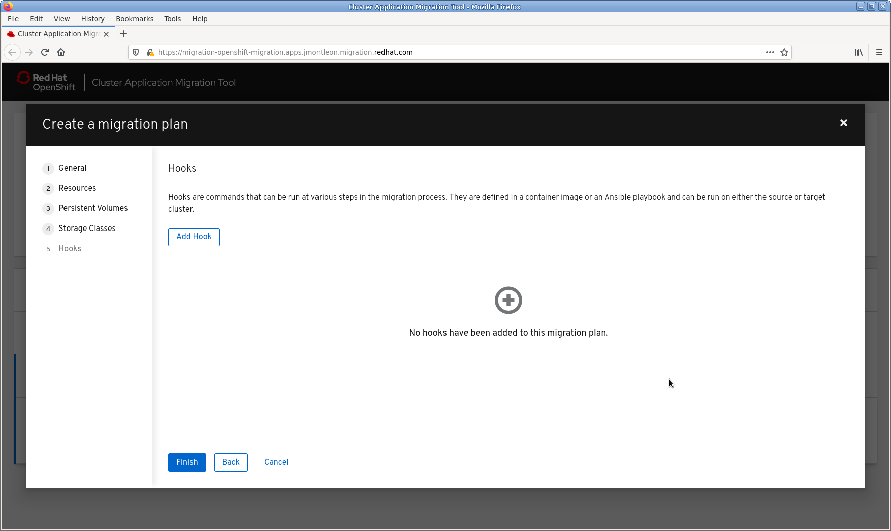
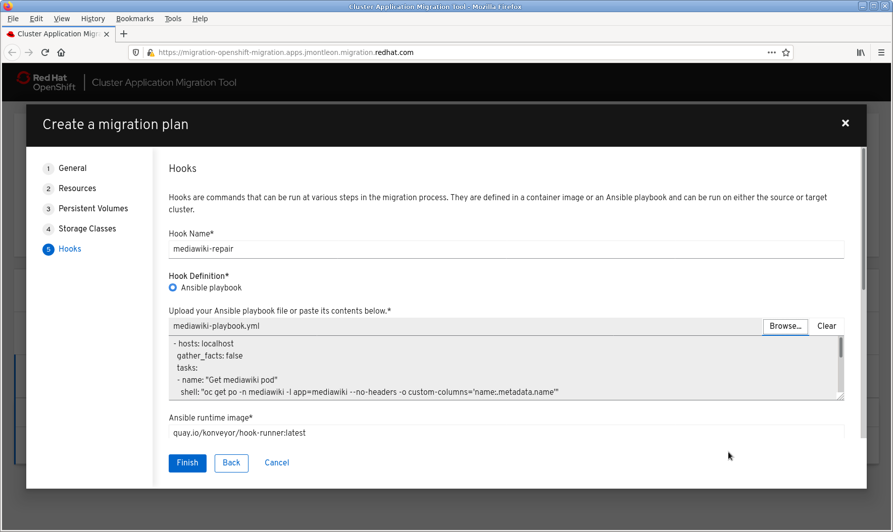
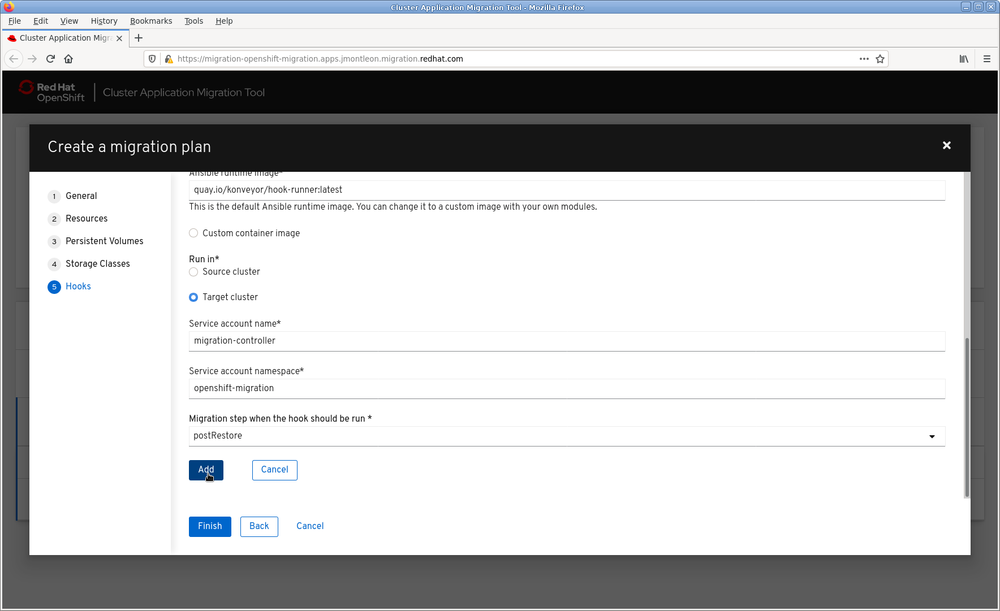

# Introduction
Migration hooks provide a means for running custom code at points in the migration to handle logic unique to a migration. This may include scenarios where custom quiesce logic is desired, manual data migration of unsupported types is needed, or to handle application repair after it has been migrated to a new environment.

There are two primary methods of creating a hook. The first is to write an Ansible playbook that is run either on an image we provide or one you create with additional ansibile modules or tools that you require. The other is to create a custom hook container and the entrypoint will be executed.

There are currently 4 phases within a migration where migration hooks can br run. One hook may be run per phase for a maximum total of 4 hooks per migration, and hooks in any phase may be run either on the source of destination cluster.

The phases where hooks may be run are:
- PreBackup: Before any task is performed.
- PostBackup: After all backup tasks are complete.
- PreRestore: Before any restore tasks are performed.
- PreBackup: After all restore tasks are complete.

# Default hook image
The default hook image is `quay.io/konveyor/hook-runner:latest`. It is based off of the Ansible Runner image with the addition of python-openshift to provided Ansible k8s resources as well as a recent oc binary.

# Writing ansible for hooks
When writing ansible to run within the hook pod it is possible to use the `oc` command or the k8s modules to accomplish tasks. A token is mounted in the container for the specified service account so there is no need to manually authenticate before running tasks in the cluster.

```
- hosts: localhost
  gather_facts: false
  tasks:
  - name: get pod name
    shell: oc get po --all-namespaces
```

```
- hosts: localhost
  gather_facts: false
  tasks:
  - name: Get pod
    k8s_facts:
      kind: pods
      api: v1
      namespace: openshift-migration
      name: "{{ lookup( 'env', 'HOSTNAME') }}"
    register: pods

  - name: Print pod name
    debug:
      msg: "{{ pods.resources[0].metadata.name }}"
```

# Special Environment variables
The migplan name and associated namespaces are passed in as environment variables to the job container so they can be used in writing tasks. To access use an env lookup.

For example:
```
- hosts: localhost
  gather_facts: false
  tasks:
  - set_fact:
      namespaces: "{{ (lookup( 'env', 'MIGRATION_NAMESPACES')).split(',') }}"

  - debug:
      msg: "{{ item }}"
    with_items: "{{ namespaces }}"

  - debug:
      msg: "{{ lookup( 'env', 'MIGRATION_PLAN_NAME') }}"
```

# Hook execution
When an Ansible playbook is provided as part of a migration hook it will be mounted into the hook container as a ConfigMap. In either case the hook container will be run as job on the desired cluster, using the execution ServiceAccount and Namespace specified. Jobs are designed to run to completion, even if the initial pod is evicted or killed, and may attempt to run several times up until it it either reaches the backoffLimit or successful completion. We use the default backoffLimit of 6 for hook jobs.

# Hook Success/Failure
Hooks are run as Jobs and success and failure is detected based on the Job container exit status. The `fail` module can produce a non-zero exit status when detecting cases where a non-zero exit status would not normally be produced, to ensure the hook task fails.
```
- hosts: localhost
  gather_facts: false
  tasks:
  - name: Set a boolean
    set_fact:
      do_fail: true

  - name: "fail"
    fail:
      msg: "Cause a failure"
    when: do_fail
```

When using a custom image without Ansible and a failure condition is detected ensure the process returns a non-zero exit code. This will ensure that the hook will fail.

# Adding a hook to a MigPlan
To add a hook to a MigPlan resources modify spec.Hooks on your migplan CR. xxxby providing the name/namespace Ref for the Phase. For example:

- executionNamespace: A required parameter specifying the namespace the hook will be run in.
- phase: Contains the phase the hook will run in. At this time only one hook may be specified per supported phase.
- reference: Contains the name of the hook and namespace it is located in.
- serviceAccount: A required parameter specifying the ServiceAccount the hook will be run with.

```
apiVersion: migration.openshift.io/v1alpha1
kind: MigPlan
metadata:
  name: test
  namespace: openshift-migration
spec:
  hooks:
    - executionNamespace: openshift-migration
      phase: PostRestore
      reference:
        name: mediawiki-repair
        namespace: openshift-migration
      serviceAccount: migration-controller
  ...
```

# Adding a MigHook CR
The MigHook CR represents a hook and an example is provided below.

The available parameters are:
- activeDeadlineSeconds: This is an optional parameter that determines how long the job may run before it is considered failed. If not provided we default to 1800 seconds (30 minutes).
- custom: A required parameter specifying whether this is an Ansible or Custom hook. If custom is true playbook should not be defined.
- image: A required parameter specifying the image to be run.
- playbook: This is an optional parameter containing a base64 encoded Ansible playbook. If not provided the containers default entrypoint will be executed.
- targetCluster: A requried parameter specifying which cluster the hook will be run on. `destination` and `source` are the only valid values.

```
apiVersion: migration.openshift.io/v1alpha1
kind: MigHook
metadata:
  name: mediawiki-repair
  namespace: openshift-migration
spec:
  activeDeadlineSeconds: 1800
  custom: false
  image: quay.io/konveyor/hook-runner:latest
  executionNamespace: openshift-migration
  serviceAccount: migration-controller
  playbook: LSBob3N0czogbG9jYWxob3N0CiAgZ2F0aGVyX2ZhY3RzOiBmYWxzZQogIHRhc2tzOgogIC0gbmFtZTogIkdldCBtZWRpYXdpa2kgcG9kIgogICAgc2hlbGw6ICJvYyBnZXQgcG8gLW4gbWVkaWF3aWtpIC1sIGFwcD1tZWRpYXdpa2kgLS1uby1oZWFkZXJzIC1vIGN1c3RvbS1jb2x1bW5zPSduYW1lOi5tZXRhZGF0YS5uYW1lJyIKICAgIHJlZ2lzdGVyOiBwb2RfbmFtZQoKICAtIG5hbWU6ICJHZXQgY3VycmVudCB3Z1NlcnZlciB2YWx1ZSIKICAgIHNoZWxsOiAib2MgZXhlYyAtbiBtZWRpYXdpa2kge3sgcG9kX25hbWUuc3Rkb3V0IH19IC0tIGdyZXAgLWkgd2dTZXJ2ZXIgL3BlcnNpc3RlbnQvTG9jYWxTZXR0aW5ncy5waHAgfCBhd2sgLUYgJ1wiJyAneyBwcmludCAkKE5GLTEpIH0nIgogICAgcmVnaXN0ZXI6IG9sZF93Z3NlcnZlcgoKICAtIG5hbWU6ICJQcmludCBjdXJyZW50IHZhbHVlIgogICAgZGVidWc6CiAgICAgIG1zZzogIlRoZSBvbGQgd2dTZXJ2ZXIgdmFsdWUgaXM6IHt7IG9sZF93Z3NlcnZlci5zdGRvdXQgfX0iCgogIC0gbmFtZTogIkdldCBuZXcgcm91dGUgYWRkcmVzcyIKICAgIHNoZWxsOiAib2MgZ2V0IHJvdXRlIC1uIG1lZGlhd2lraSAtbCBhcHA9bWVkaWF3aWtpIC0tbm8taGVhZGVycyAtbyBjdXN0b20tY29sdW1ucz0naG9zdDouc3BlYy5ob3N0JyIKICAgIHJlZ2lzdGVyOiByb3V0ZV9ob3N0CgogIC0gbmFtZTogIlByaW50IG5ldyByb3V0ZSBob3N0bmFtZSIKICAgIGRlYnVnOgogICAgICBtc2c6ICJUaGUgbmV3IHJvdXRlIGhvc3RuYW1lIGlzIHt7IHJvdXRlX2hvc3Quc3Rkb3V0IH19IgoKICAtIG5hbWU6ICJSZXBsYWNlIHdnU2VydmVyIHZhbHVlIgogICAgc2hlbGw6ICJvYyBleGVjIC1uIG1lZGlhd2lraSB7eyBwb2RfbmFtZS5zdGRvdXQgfX0gLS0gc2VkIC1pICdzLF4kd2dTZXJ2ZXIuKiwkd2dTZXJ2ZXIgPSBcImh0dHA6Ly97eyByb3V0ZV9ob3N0LnN0ZG91dCB9fVwiOyxnJyAvcGVyc2lzdGVudC9Mb2NhbFNldHRpbmdzLnBocCIKCiAgLSBuYW1lOiAiR2V0IGN1cnJlbnQgd2dTZXJ2ZXIgdmFsdWUiCiAgICBzaGVsbDogIm9jIGV4ZWMgLW4gbWVkaWF3aWtpIHt7IHBvZF9uYW1lLnN0ZG91dCB9fSAtLSBncmVwIC1pIHdnU2VydmVyIC9wZXJzaXN0ZW50L0xvY2FsU2V0dGluZ3MucGhwIHwgYXdrIC1GICdcIicgJ3sgcHJpbnQgJChORi0xKSB9JyIKICAgIHJlZ2lzdGVyOiBuZXdfd2dzZXJ2ZXIKCiAgLSBuYW1lOiAiUHJpbnQgY3VycmVudCB2YWx1ZSIKICAgIGRlYnVnOgogICAgICBtc2c6ICJUaGUgbmV3IHdnU2VydmVyIHZhbHVlIGlzOiB7eyBuZXdfd2dzZXJ2ZXIuc3Rkb3V0IH19IgoKICAtIG5hbWU6ICJSZXN0YXJ0IG1lZGlhd2lraSIKICAgIHNoZWxsOiAib2MgZGVsZXRlIHBvIC1uIG1lZGlhd2lraSAtbCBhcHA9bWVkaWF3aWtpIgo=
  targetCluster: destination
```

# Web UI Hook Creation
A new step has been added when creating a migration plan to allow for the addition of hooks.

1. Click Add Hook.

2. Provide a name.
3. Upload a playbook and specify an `Ansible runtime image`, or choose `Custom container image` and specify a custom image.

4. Select whether the hook will run on the Source or Destination cluster.
5. Provide the Service account name and namespace.
6. Select the phase the hook will run in.
7. Click Add.


You may repeat the process to add one hook per phase.

# References
[Youtube Demo](https://www.youtube.com/watch?v=so5UJENeB-4). This video demonstrates the repair of a mediwwiki application using an Ansible playbook after the restore is complete.
[Demo Resources] https://github.com/jmontleon/mighook-demo-resources

# Examples

## Repair Mediawiki after Migration
```
- hosts: localhost
  gather_facts: false
  tasks:
  - name: "Get mediawiki pod"
    shell: "oc get po -n mediawiki -l app=mediawiki --no-headers -o custom-columns='name:.metadata.name'"
    register: pod_name

  - name: "Get current wgServer value"
    shell: "oc exec -n mediawiki {{ pod_name.stdout }} -- grep -i wgServer /persistent/LocalSettings.php | awk -F '\"' '{ print $(NF-1) }'"
    register: old_wgserver

  - name: "Print current value"
    debug:
      msg: "The old wgServer value is: {{ old_wgserver.stdout }}"

  - name: "Get new route address"
    shell: "oc get route -n mediawiki -l app=mediawiki --no-headers -o custom-columns='host:.spec.host'"
    register: route_host

  - name: "Print new route hostname"
    debug:
      msg: "The new route hostname is {{ route_host.stdout }}"

  - name: "Replace wgServer value"
    shell: "oc exec -n mediawiki {{ pod_name.stdout }} -- sed -i 's,^$wgServer.*,$wgServer = \"http://{{ route_host.stdout }}\";,g' /persistent/LocalSettings.php"

  - name: "Get current wgServer value"
    shell: "oc exec -n mediawiki {{ pod_name.stdout }} -- grep -i wgServer /persistent/LocalSettings.php | awk -F '\"' '{ print $(NF-1) }'"
    register: new_wgserver

  - name: "Print current value"
    debug:
      msg: "The new wgServer value is: {{ new_wgserver.stdout }}"

  - name: "Restart mediawiki"
    shell: "oc delete po -n mediawiki -l app=mediawiki"
```

## Add a dnsConfig value to every deployment after migration
```
- hosts: localhost
  gather_facts: false
  vars:
    deployment_definition:
      apiVersion: "{{ item.apiVersion }}"
      kind: "{{ item.kind }}"
      metadata:
        name: "{{ item.metadata.name }}"
        namespace: "{{ item.metadata.namespace }}"
      spec:
        template:
          spec:
            dnsConfig:
              searches:
              - redhat.com
  tasks:
  - name: Get list of namespaces and declare deployments
    set_fact:
      namespaces: "{{ (lookup( 'env', 'MIGRATION_NAMESPACES')).split(',') }}"
      deployments: []

  - name: Lookup deployments
    k8s_info:
      api_version: apps/v1
      kind: Deployment
      namespace: "{{ item }}"
    with_items: "{{ namespaces }}"
    register: discovered_deployments

  - name: Combine lists of deployments
    set_fact:
      deployments: "{{ deployments + item.resources }}"
    with_items: "{{ discovered_deployments.results }}"
    vars:
    loop_control:
      label: "{{ 'namespace: ' + item.item }}"

  - name: Update Deployment Containers
    k8s:
      definition: "{{ deployment_definition }}"
    with_items: "{{ deployments }}"
    loop_control:
      label: "{{ item.metadata.namespace + '/' + item.metadata.name  }}"
```

## A PostRestore Hook to find Paused DCs and Deployments, unpause them so they rollout, then repause
```
- hosts: localhost
  gather_facts: false
  vars:
    resource_definition:
      apiVersion: "{{ item.apiVersion }}"
      kind: "{{ item.kind }}"
      metadata:
        name: "{{ item.metadata.name }}"
        namespace: "{{ item.metadata.namespace }}"
      spec:
        paused: "{{ paused }}"
  tasks:
  - name: Get list of namespaces, declare deployments, and dcs
    set_fact:
      namespaces: "{{ (lookup( 'env', 'MIGRATION_NAMESPACES')).split(',') }}"
      deployments: []
      dcs: []
      paused_deployments: []
      paused_dcs: []

  - name: Lookup deployments
    k8s_info:
      api_version: apps/v1
      kind: Deployment
      namespace: "{{ item }}"
    with_items: "{{ namespaces }}"
    register: discovered_deployments

  - name: Lookup dcs
    k8s_info:
      api_version: apps.openshift.io/v1
      kind: DeploymentConfig
      namespace: "{{ item }}"
    with_items: "{{ namespaces }}"
    register: discovered_dcs

  - name: Combine lists of deployments
    set_fact:
      deployments: "{{ deployments + item.resources }}"
    with_items: "{{ discovered_deployments.results }}"
    vars:
    loop_control:
      label: "{{ 'namespace: ' + item.item }}"

  - name: Combine lists of dcs
    set_fact:
      dcs: "{{ dcs + item.resources }}"
    with_items: "{{ discovered_dcs.results }}"
    vars:
    loop_control:
      label: "{{ 'namespace: ' + item.item }}"

  - name: Produce list of paused deployemnts
    set_fact:
      paused_deployments: "{{ paused_deployments + [item] }}"
    with_items: "{{ deployments }}"
    loop_control:
      label: "{{ item.metadata.namespace + '/' + item.metadata.name  }}"
    when: item.spec.paused is defined and item.spec.paused is true

  - name: Produce list of paused deployemnts
    set_fact:
      paused_dcs: "{{ paused_dcs + [item] }}"
    with_items: "{{ dcs }}"
    loop_control:
      label: "{{ item.metadata.namespace + '/' + item.metadata.name  }}"
    when: item.spec.paused is defined and item.spec.paused is true

  - name: Unpause Deployments
    k8s:
      definition: "{{ resource_definition }}"
    with_items: "{{ paused_deployments }}"
    loop_control:
      label: "{{ item.metadata.namespace + '/' + item.metadata.name  }}"
    vars:
      paused: false

  - name: Unpause DCs
    k8s:
      definition: "{{ resource_definition }}"
    with_items: "{{ paused_dcs }}"
    loop_control:
      label: "{{ item.metadata.namespace + '/' + item.metadata.name  }}"
    vars:
      paused: false

  - name: Pause Deployments
    k8s:
      definition: "{{ resource_definition }}"
    with_items: "{{ paused_deployments }}"
    loop_control:
      label: "{{ item.metadata.namespace + '/' + item.metadata.name  }}"
    vars:
      paused: true

  - name: Pause DCs
    k8s:
      definition: "{{ resource_definition }}"
    with_items: "{{ paused_dcs }}"
    loop_control:
      label: "{{ item.metadata.namespace + '/' + item.metadata.name  }}"
    vars:
      paused: true
```
