# 3.0 Migrate MSSQL Application

The first application that we are going to migrate is a simple Product Inventory web-based application front-end, backed backed by Microsoft SQL Server.  This application will deploy into the mssql-persistent namespace using a single PV backed by NFS for persistent storage.


First we'll need to deploy the mssql app to our _source cluster_ using yaml from the [https://github.com/fusor/mig-demo-apps/](mig-demo-apps) repo.
```bash
oc create -f https://raw.githubusercontent.com/fusor/mig-demo-apps/master/apps/mssql-app/manifest.yaml
```

We should see mssql-persistent come up.

```bash
$ oc get pods -n mssql-persistent
NAME                                    READY   STATUS    RESTARTS   AGE
mssql-app-deployment-6ffb46c5d6-n5fvv   1/1     Running   0          41m
mssql-deployment-1-xq4p4                1/1     Running   0          41m
```

Let's get the route to the application, and bring up the webUI.

```bash
$ oc get route -n mssql-persistent
NAME              HOST/PORT                                                       PATH   SERVICES     PORT 
mssql-app-route   mssql-app-route-mssql-persistent.apps.srccluster.com          db-app-svc   5000 
```

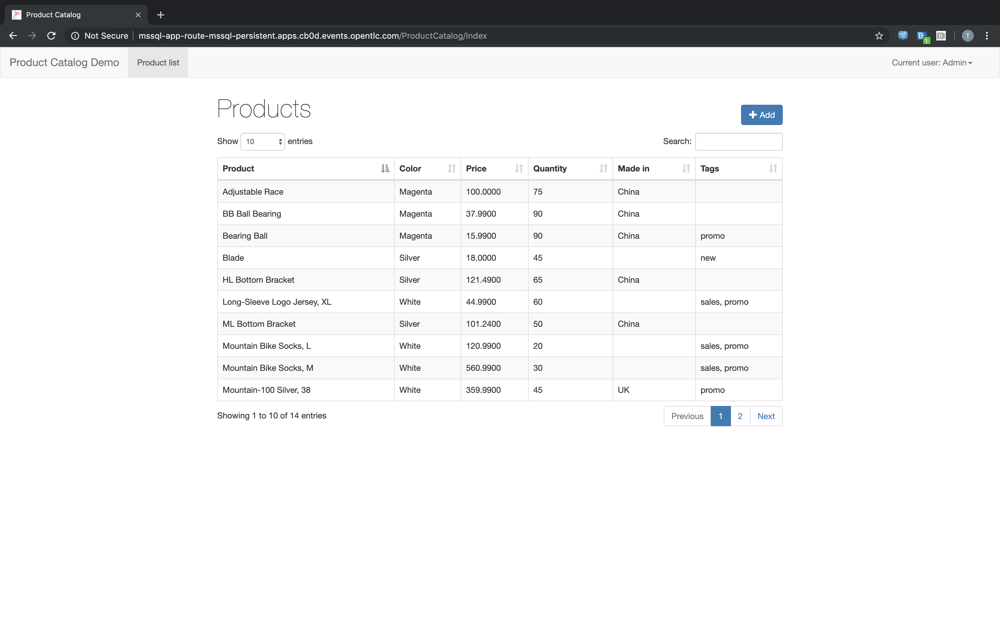

Let's go ahead and add a new product to the inventory.  Click on the +Add button and enter some data.

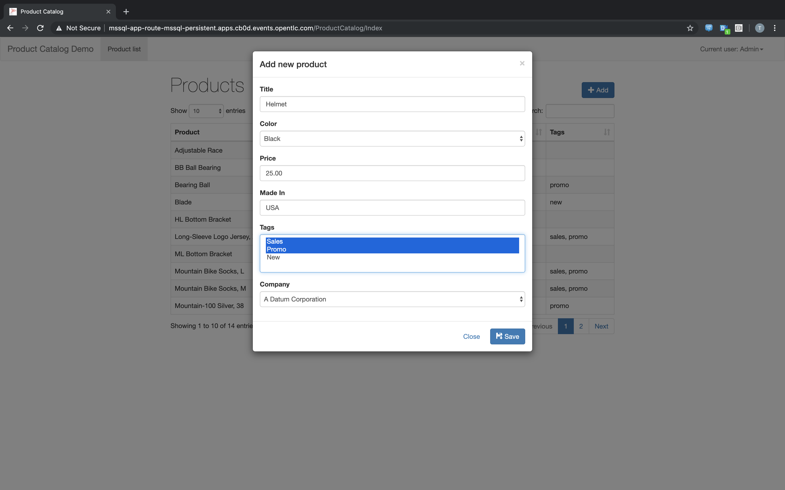

You can see the application is functioning and state is being saved in the DB.  

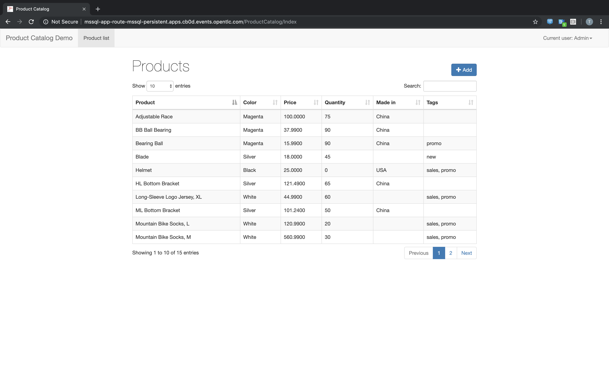

Let's also verify that the application is NOT installed on our 4.1 destination cluster.  First login to 4.1. You can see that no pods are running; and in fact the mssql-persistent namespace does *not* exist.

## 3.2 Using CAM

Next, let's open up the migration UI. Again, to get the route, run the following command on the destination 4.1 cluster:
```bash
$ oc get routes migration -n mig -o jsonpath='{.spec.host}'
 migration-mig.apps.cluster-a21d.a21d.sandbox67.opentlc.com
```

The screen should look something like:

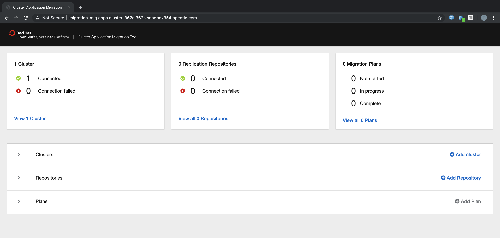

### 3.2.1 Add a Cluster

First thing we want to do is add the source OCP cluster we wish to migrate the
application from. Click `Add cluster`:

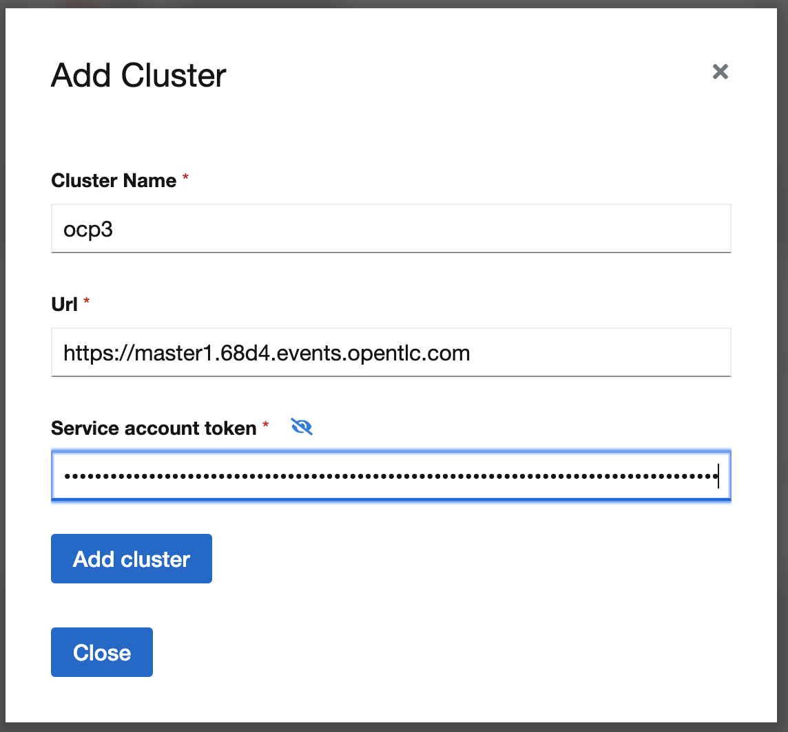

Fill out the neccessary information. We will need an Service Account Token in order for destination cluster to talk to source cluster:

`Run the following against your source cluster.`

```bash
$ oc sa get-token -n mig openshift-migration
eyJhbGciOifsfsds8ahmtpZCI6IiJ9fdsfdseyJpc3MiOiJrdWJlcm5ldGVzL3NlcnZpY2VhY2NvdW50Iiwia3ViZXJuZXRlcy5pby9zZXJ2aWNlYWNjb3VudC9uYW1lc3BhY2UiOiJtaWciLCJrdWJlcm5ldGVzLmlvL3NlcnZpY2VhY2NvdW50L3NlY3JldC5uYW1lIjoibWlnLXRva2VuLTdxMnhjIiwia3ViZXJuZXRlcy5pby9zZXJ2aWNlYWNjb3VudC9zZXJ2aWNlLWFjY291bnQubmFtZSI6Im1pZyIsImt1YmVybmss7gc2VydmljZWFjY291bnQvc2VydmljZS1hY2NvdW50LnVpZCI6IjQ5NjYyZjgxLWEzNDItMTFlOS05NGRjLTA2MDlkNjY4OTQyMCIsInN1YiI6InN5c3RlbTpzZXJ2aWNlYWNjb3VudDptaWc6bWlnIn0.Qhcv0cwP539nSxbhIHFNHen0PNXSfLgBiDMFqt6BvHZBLET_UK0FgwyDxnRYRnDAHdxAGHN3dHxVtwhu-idHKI-mKc7KnyNXDfWe5O0c1xWv63BbEvyXnTNvpJuW1ChUGCY04DBb6iuSVcUMi04Jy_sVez00FCQ56xMSFzy5nLW5QpLFiFOTj2k_4Krcjhs8dgf02dgfkkshshjfgfsdfdsfdsa8fdsgdsfd8fasfdaTScsu4lEDSbMY25rbpr-XqhGcGKwnU58qlmtJcBNT3uffKuxAdgbqa-4zt9cLFeyayTKmelc1MLswlOvu3vvJ2soFx9VzWdPbGRMsjZWWLvJ246oyzwykYlBunYJbX3D_uPfyqoKfzA

# We need to save the output of the 'get-token', that is the long string we will enter into the mig-ui when we create a new cluster entry.
```

When done, click `Add Cluster`. You should see a `Connection successful` message. Click `Close`.

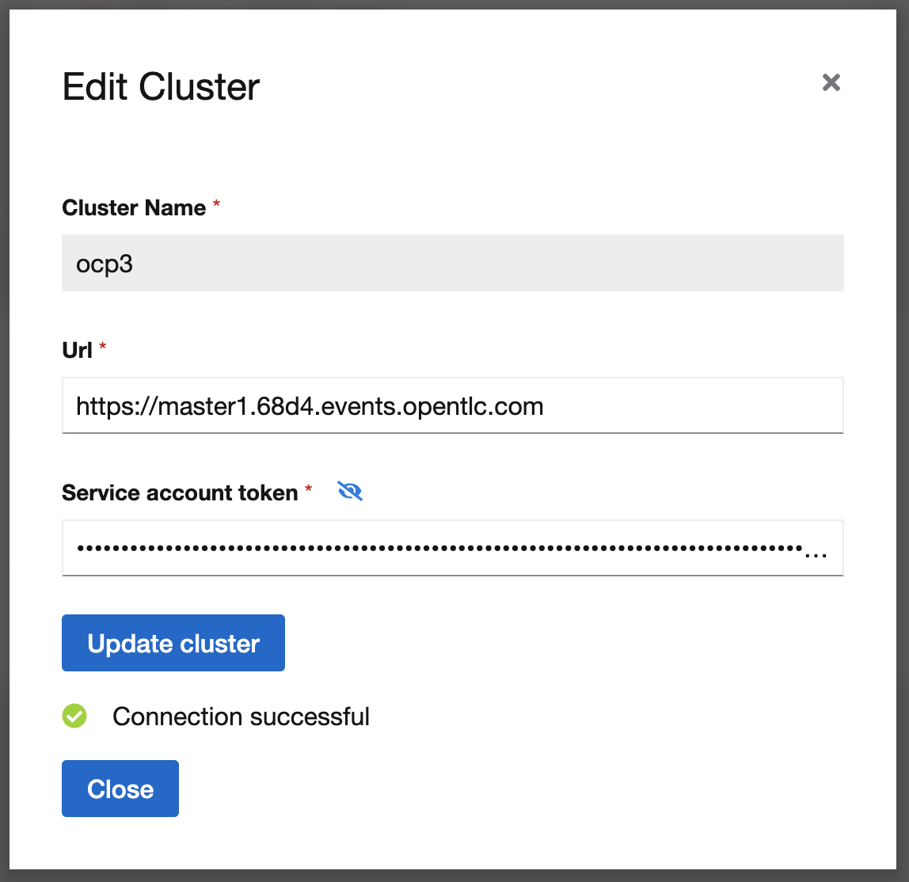

Now you should see the source and destination clusters populated.

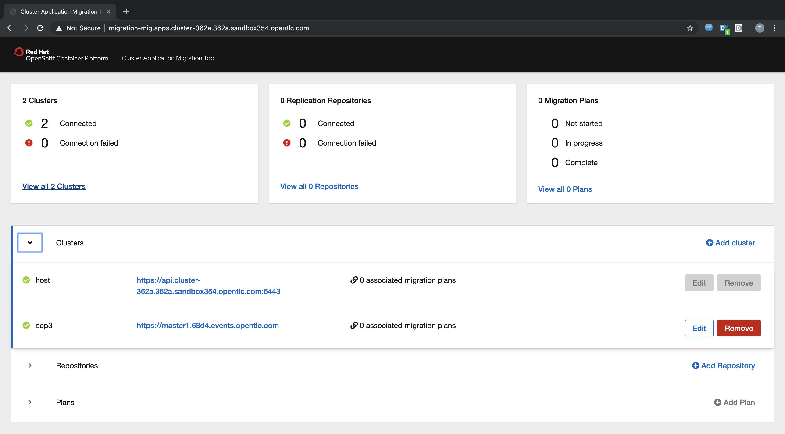

### 3.2.2 Setup a Minio bucket as a replication repository

Next we want to add a replication repository. Click `Add Repository`:

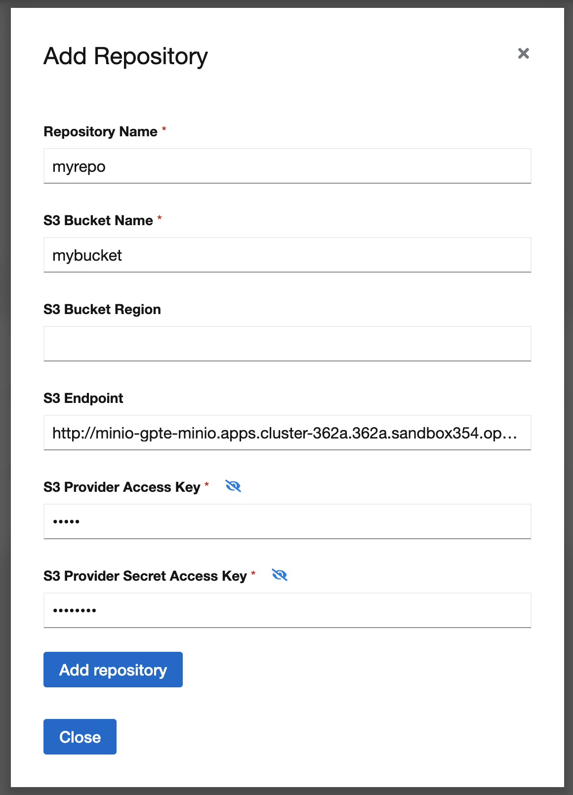

Fill out the information from the from the bucket we created in Lab 2.  Leave the `S3 Bucket Region` field blank.  Click `Add repository` and you should see a `Connection successful` message. Click `Close`.

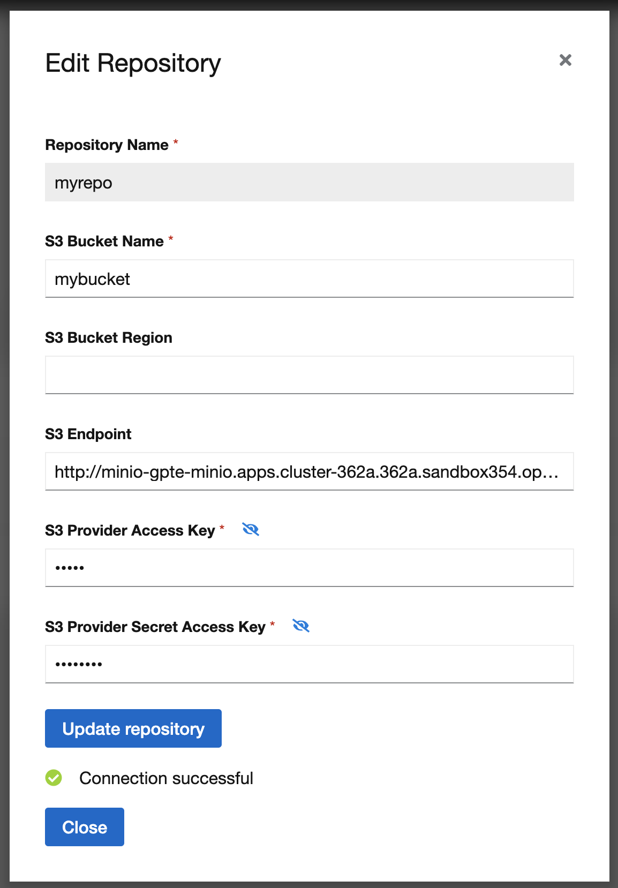

You should now see the repository `myrepo` populated.

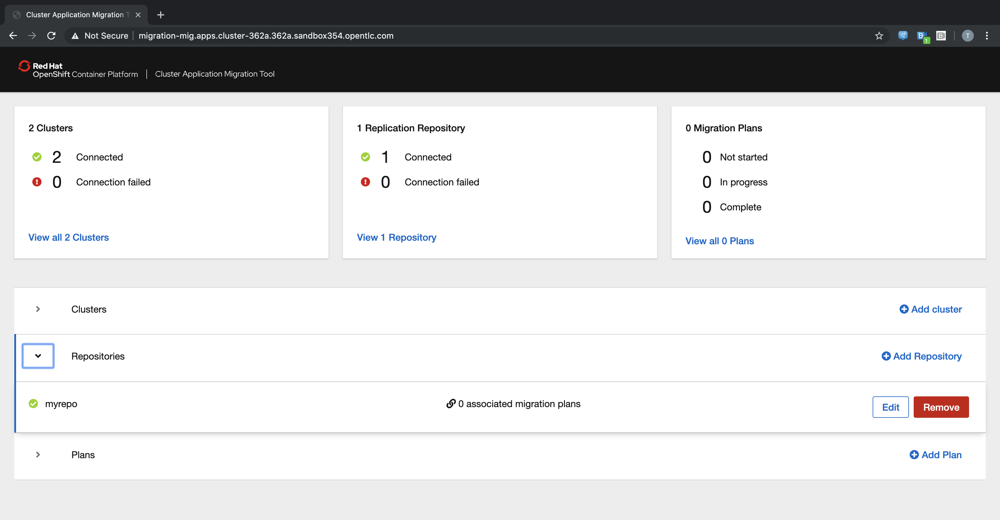

### 3.2.3 Create a Migration Plan

Now that we have a replication repository specified and both the source and
destination clusters defined, we can create a migration plan. Click `Add Plan`:

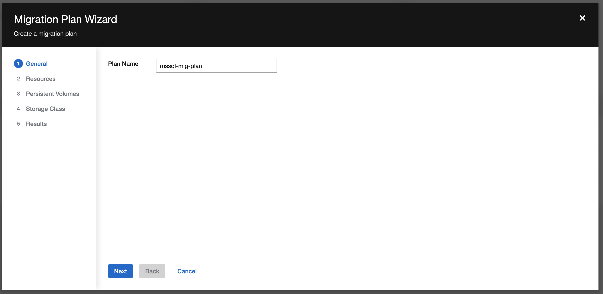

Fill out a plan name. Click Next.

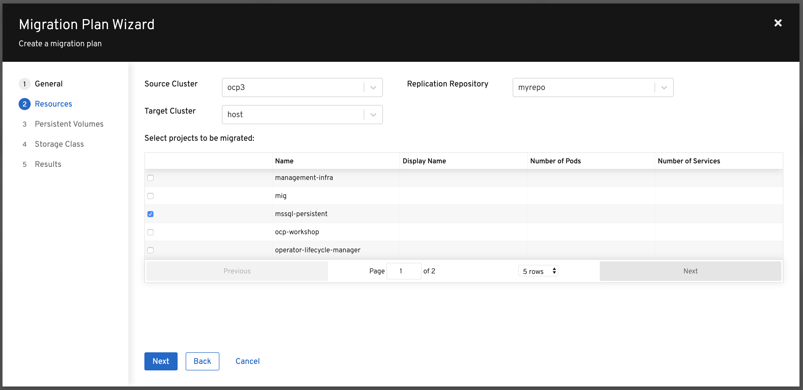

Select the source and target cluster, the replication repository, and the `mssql-persistent` namespace (which we want to migrate over). Click Next.

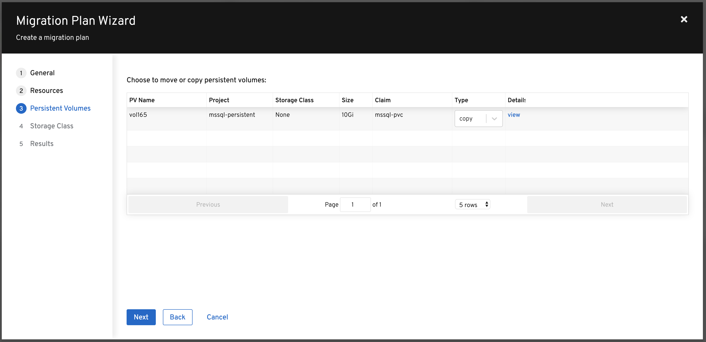

Now we are displayed a list of persistent volumes associated with our
application workload. Select which type of action you would like to perform on the PV. For this example, let's select `move`.  Click Next.

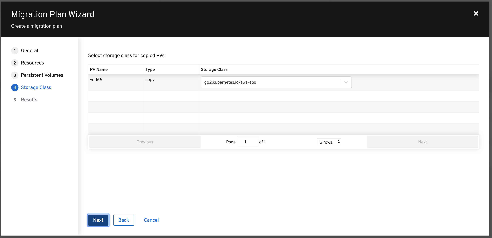

Select the storage class for your PVs.  In this case we will be copying our data from NFS to AWS-EBS (`gp2:kubernetes.io/aws-ebs`).  Click Next.

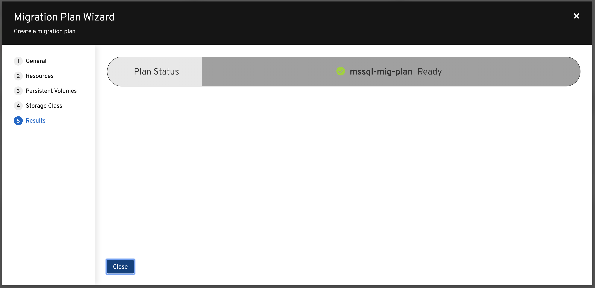

After validating the migration plan, you will see a `Ready` message and you can click `Close`.

### 3.2.4 Migrate the Application Workload

Now we can select `Migrate` or `Stage` on the application. Since we don't care about downtime for this example, let's select `Migrate`:

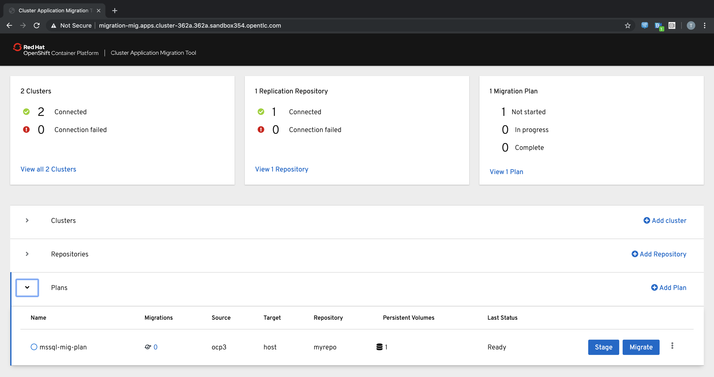

Optionally choose to *not* terminate the application on the source cluster.
Leave it unchecked and select `Migrate`.

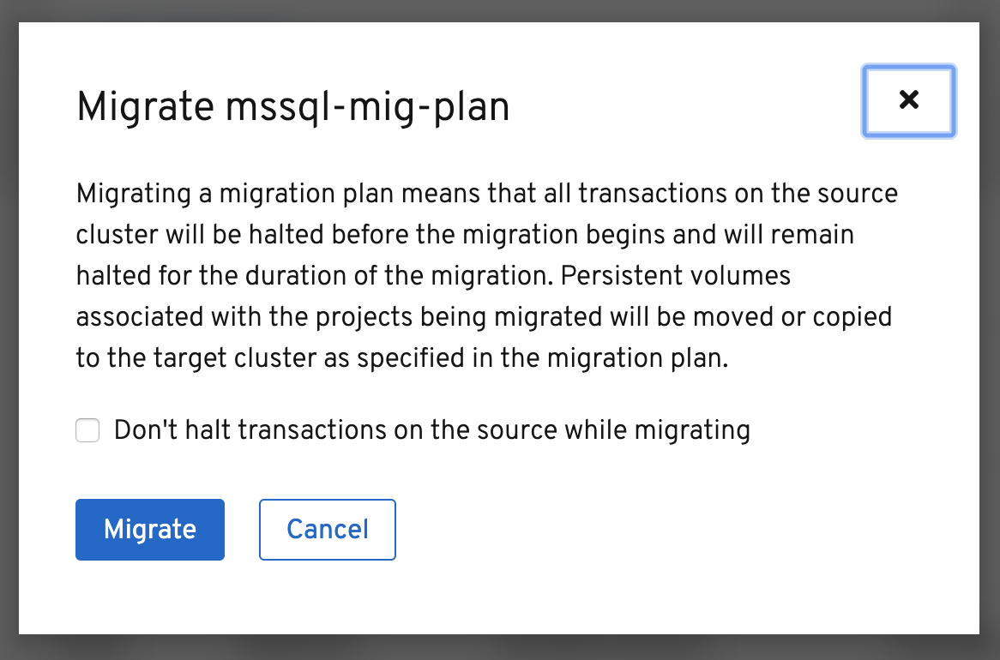

The migration will progress with a progress bar showing each step in the process.

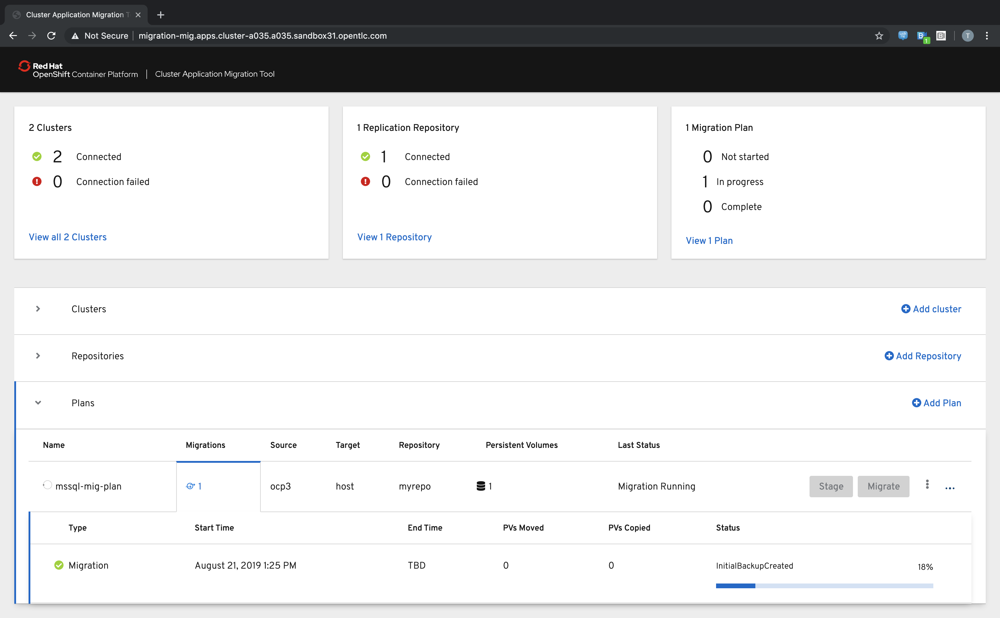

Once done, you should see `Migration Succeeded` on the migration plan.

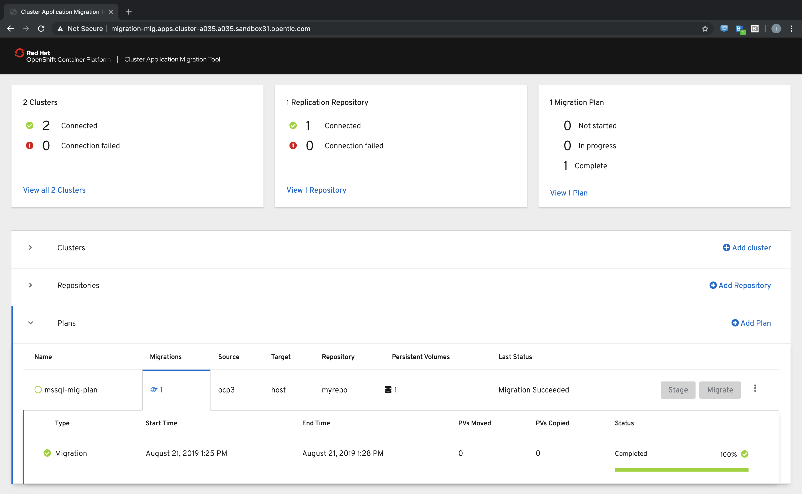


### 5.2.5 Verify application is functioning on Destination Cluster

Let's check out Pods running in the `mssql-persistent` namespace on the destination cluster.

First we can check out the Pods running on the destination and verify they meet our expectation.
```bash
$ oc get pods -n mssql-persistent
NAME                                    READY   STATUS    RESTARTS   AGE
mssql-app-deployment-6ffb46c5d6-n5fvv   1/1     Running   0          5m
mssql-deployment-1-xq4p4                1/1     Running   0          6m
```

Next, let's check for a newly created route on the destination cluster.
```bash
$  oc get route -n mssql-persistent
NAME              HOST/PORT                                                 PATH   SERVICES   
mssql-app-route   mssql-app-route-mssql-persistent.apps.destcluster.com     db-app-svc   5000 
```

Open the route in a browser and verify the mssql demo app is functional.

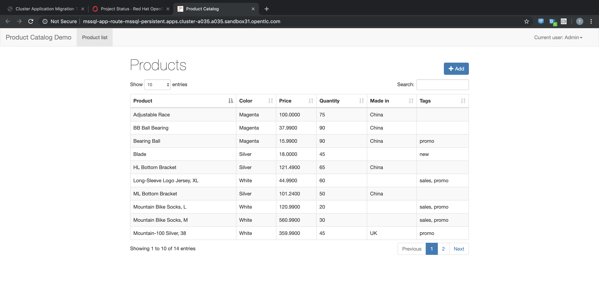

Next Section: [Section 4 - Migrate Sock Shop Application](./4.md)<br>
Previous Section: [Section 2 - CAM Overview](./2.md)<br>
[Home](./README.md)
