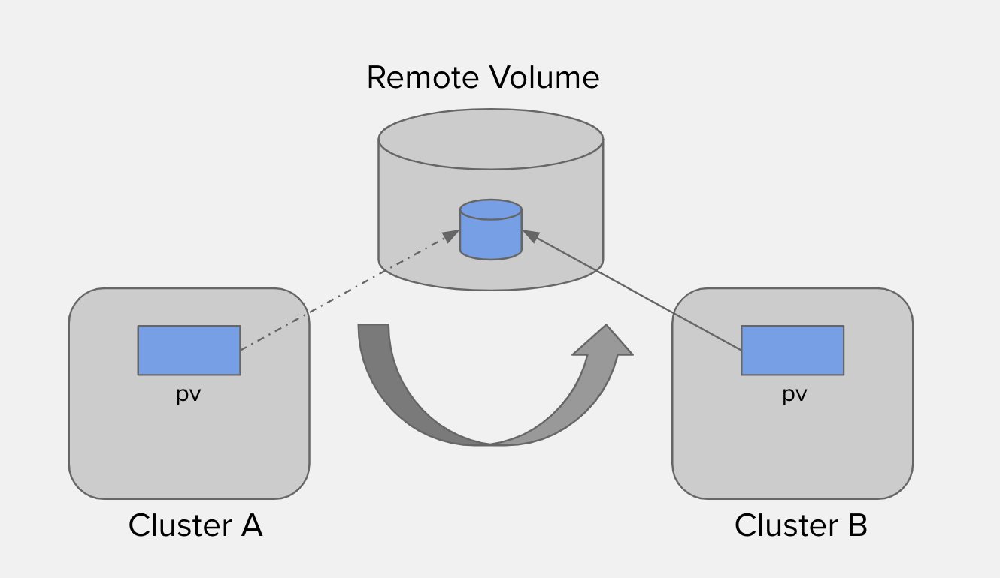
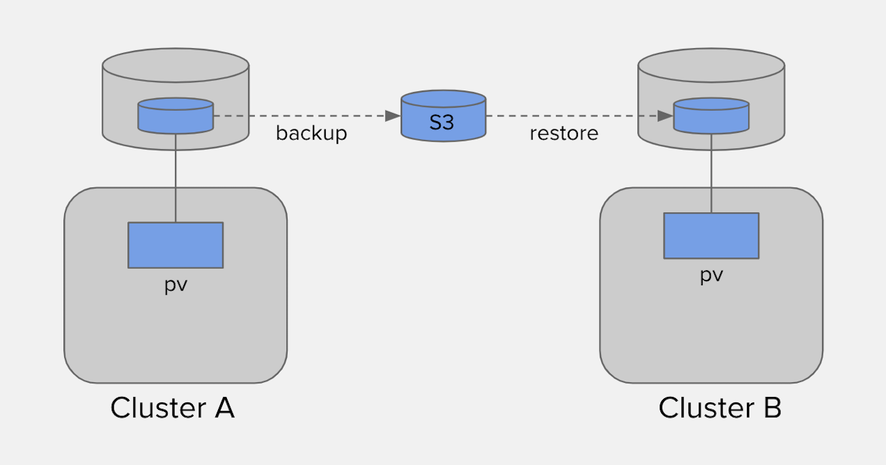
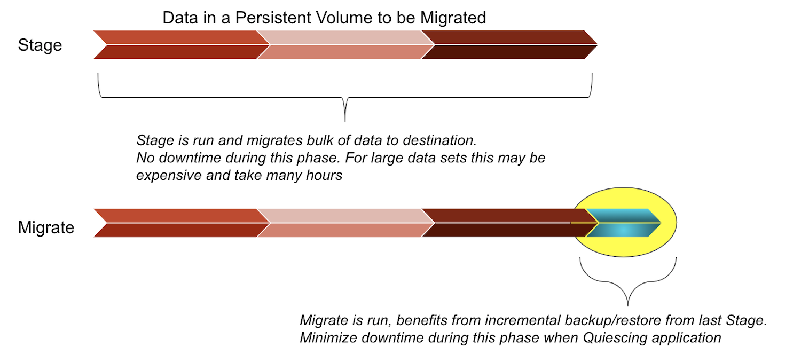
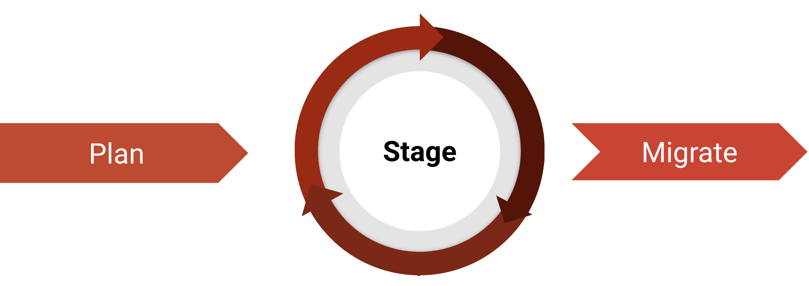

# 4.0 Cluster Application Migration Tool (CAM)

CAM is designed to migrate Application Workloads between OpenShift clusters.  Specifically, CAM handles migration of k8s resource objects, persistent volumes, and internal images.  CAM is designed to provide a migration experience while focusing on minimizing application downtime through the process.

## 4.1 Upstream Projects

CAM leverages two upstream projects: [Velero](https://github.com/heptio/velero) and [Restic](https://restic.net/).  Velero (formerly Heptio Ark) gives you tools to back up and restore your Kubernetes cluster resources and persistent volumes.  Restic is a backup program that is fast, efficient and secure.


## 4.2 Architecture

CAM is implemented as a native k8s API extension through a custom resource definition.  CAM orchestrates usage of Velero for performing backup/restores.  OpenShift specific functionality os implemented in a series of Velero plugins.  CAM is also equipped with a React/Patternfly 4 web UI to provide simple interactive experience.

#### IMPORTANT

> * **Migration is at scope of a Namespace**.  Future versions will allow selecting resources inside of a Namespace

>* **Cluster Scoped Resources are not handled**.  Cluster Role Bindings, SCCs, etc are not handled with migration.

> * **‘cluster-admin’ role required for initial release targeting OCP 4.2**.

## 4.3 Persistent Volume Handling

CAM provides two methods for migrating persistent volumes: (1) **Move** and (2) **Copy**.  

1. Move or "swinging" the PV recreates the PVC/PV definitions from source cluster to destination cluster.  This option is highly desirable for environments with shared storage between the source and target clusters (i.e. NFS).



2. Copy creates a copy of the data from source cluster into the destination cluster.  This option involves creating a PVC on destination and allowing cluster to find a PV to bind to the claim.  We then copy data into the PV.



## 4.4 Actions (Stage and Migrate)

CAM introduces two actions on a Migration Plan:

* **Stage** - Seeds data while leaving application up and running.

* **Migrate** - Quiesces the application and migrates deltas from stage runs.



#### IMPORTANT

> * Stage can be run multiple times on a Migration Plan

> * Migrate can only be run once.

## 4.5 Migration Process



There are 3 steps to the migration process within the CAM tool:

1. **Plan**
  * Select source cluster
  * Select namespaces
  * Choose Copy or Move for each Persistent volume
  * Specify intermediate object storage
  * Select destination cluster


2. **Stage**
  * Stages the data from source to destination cluster
  * May be run multiple times
  * No downtime during this step for source applications


3. **Migrate**
  * Quiesce the application
  * Migrate any delta state since last stage run

## 4.6 WebUI

Let's bring up the webUI in preparation for our first Application Migration in Lab 5.

If you don't remember the route from Lab 2, let's grab it again from our 4.1 environment.

1. Log into the 4.1 environment
```bash
$ oc login https://api.cluster-GUID.GUID.DOMAIN:6443 -u admin -p r3dh4t1!
The server uses a certificate signed by an unknown authority.
You can bypass the certificate check, but any data you send to the server could be intercepted by others.
Use insecure connections? (y/n): y
```
2. Determine the route of `mig-ui`, we will use this later to enable a CORS header on the OCP 3.x side.
```bash
$ oc get routes migration -n mig -o jsonpath='{.spec.host}'
migration-mig.apps.cluster-a21d.a21d.sandbox67.opentlc.com
```

3. Open Browser to https://migration-mig.apps.cluster-GUID.GUID.DOMAIN


We are now ready to perform our first Application Migration.

Next Lab: [Lab 5 - Migrate MSSQL Application](./5.md)<br>
Previous Lab: [Lab 3 - CPMA Overview](./3.md)<br>
[Home](./README.md)
