# 6.0 Migrate Sock-Shop Application

In this lab we are going to migrate Weaveworks' Production Internet Store, the Sock Shop.  This store is has lots of traffic daily, and Weaveworks is very concerned about minimizing any downtime/unavailability of the store. The Sock Shop is running on your 3.11 cluster, and Weaveworks is very interested in many of the new features of the OpenShift 4.x platform, and wants to migrate.

## 6.1 Application Architecture

The architecture of the Sock Shop application was intentionally designed to provide as many micro-services as possible. As seen in the image below, the micro-services are roughly defined by the function in an ECommerce site.  Networks are specified, but due to technology limitations may not be implemented in some deployments.  All services communicate using REST over HTTP.

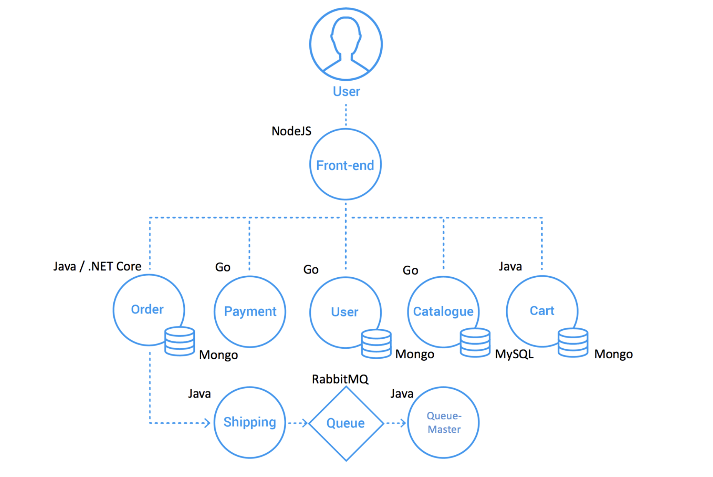

If we login to our 3.11 cluster, we can see the app running:

```bash
$ oc get pods -n sock-shop
NAME                            READY     STATUS    RESTARTS   AGE
carts-77555f7648-sdx48          1/1       Running   0          3h
carts-db-74db84c448-lv8sk       1/1       Running   0          3h
catalogue-b5fc87544-cvhb8       1/1       Running   0          3h
catalogue-db-1-c2f4w            1/1       Running   0          3h
front-end-5c49687b5c-qgzkj      1/1       Running   0          3h
orders-56b86d7dd7-gsnxh         1/1       Running   0          3h
orders-db-7645cb4d78-pmg8s      1/1       Running   0          3h
payment-685fdbcf67-4kgzn        1/1       Running   0          3h
queue-master-58bcb789cd-thq9v   1/1       Running   0          3h
rabbitmq-798d7b5976-7mgdl       2/2       Running   0          3h
session-db-7cc8ddc4cc-pxvmw     1/1       Running   0          3h
shipping-5ccdd4b459-dsvxf       1/1       Running   0          3h
user-5648777687-2zkgs           1/1       Running   0          3h
user-db-b655656b7-48qzs         1/1       Running   0          3h
```

Let's get the route to the application, and bring up the webUI.

```bash
$  oc get route -n sock-shop
NAME        HOST/PORT                                          PATH      SERVICES    PORT      TERMINATION   WILDCARD
front-end   front-end-sock-shop.apps.da30.events.opentlc.com   /         front-end   8079                    None
```

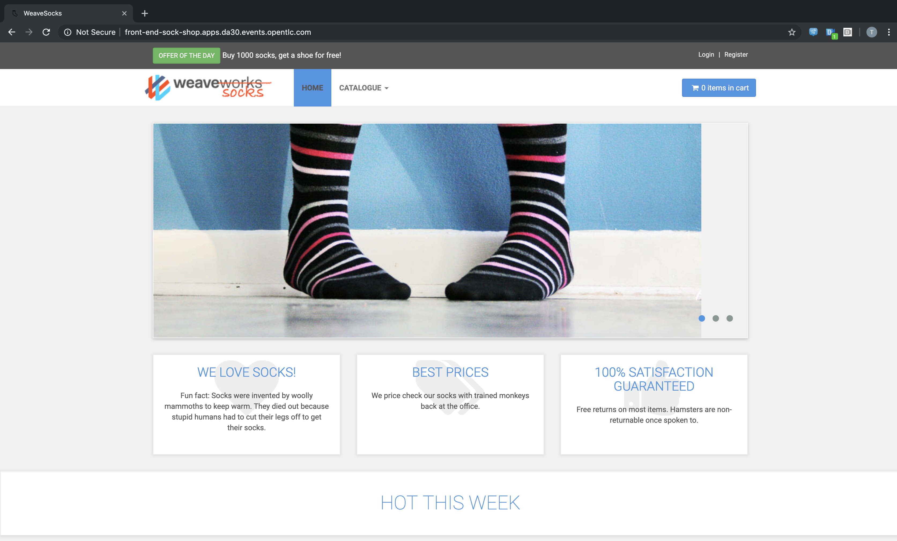

## 6.2 Migration planning

Again, the first step is to check out the CPMA generated report that we created and downloaded in Lab 3.

1. Point your browser to `File:///tmp/cpma/report.html`.

2. Open the `Cluster report` section of the report and click on `Namespaces`.   You'll see this section contains lots of detailed information by section.  Let's focus our attention in two areas: PVCs and SCCs.

3. Click to open the `PVCs` section.  You'll see that the Sock Shop application has 4 PVCs defined.  Each of these are 10Gig volumes backed by NFS.  We will need to account for all 4 of these in our Migration Plan.

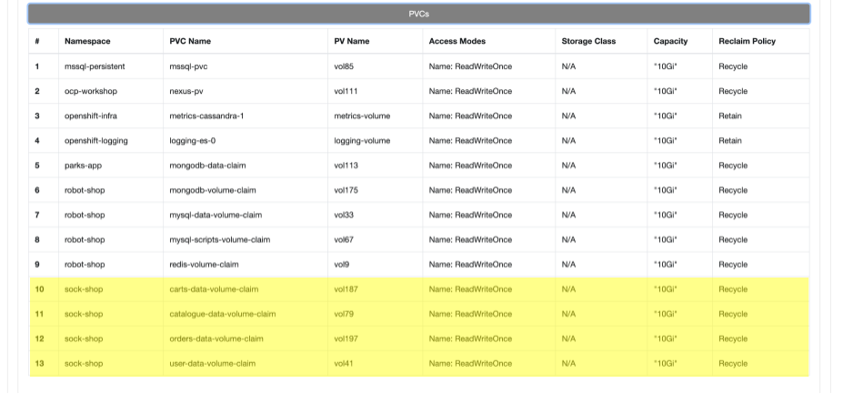

4. Click to open the `SCCs` section.  You'll see that the Sock Shop application makes use of a custom Security Context Constraint.  Again, we will need to apply this to our 4.1 cluster in preparation for migration.  Let's do this now.

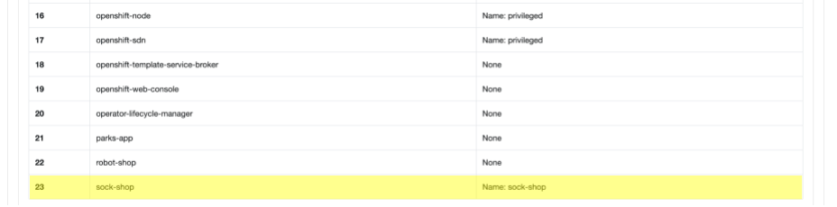

### 6.2.1 Create Sock Shop Security Context Constraint

The custom SCC yaml is available [here](./files/sock-shop-scc.yaml).  Please download to your local machine, as we will apply it in the next step.

1. Run the following to recreate Sock Shop's `scc` on the destination 4.1 cluster:
```bash
$ oc create -f sock-shop-scc.yaml
securitycontextconstraints.security.openshift.io/sock-shop created
```

## 6.3 Using CAM

Next, let's open up the migration UI. Again, to get the route, run the following command on the destination 4.1 cluster:
```bash
$ oc get routes migration -n mig -o jsonpath='{.spec.host}'
 migration-mig.apps.cluster-a21d.a21d.sandbox67.opentlc.com
```

Since we already have our source cluster, target cluster, & replication repository defined; we can move right to creating a migration plan.  Click `Add Plan`:

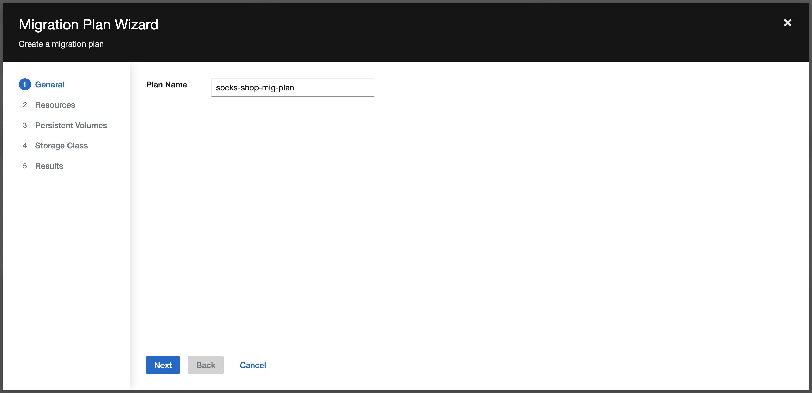

Fill out a plan name. Click Next.

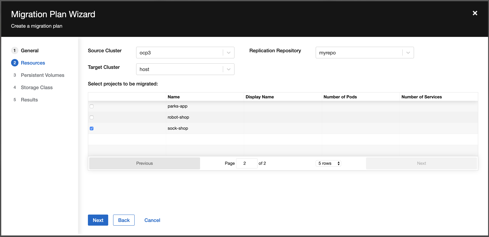

Select the source and target cluster, the replication repository, and the `sock-shop` namespace (which we want to migrate over). Click Next.

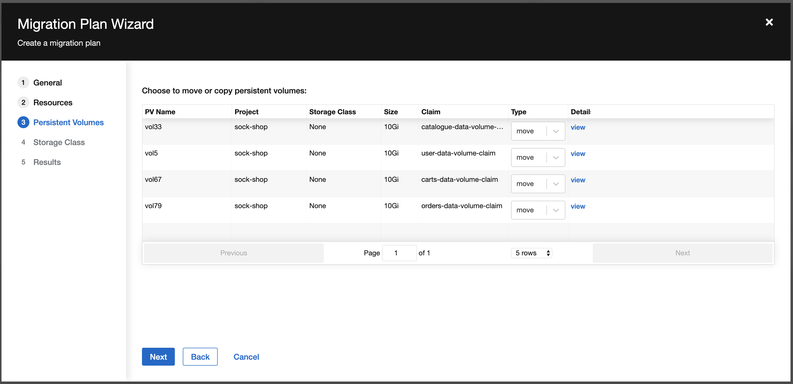

Now we are displayed the list of persistent volumes associated with our application workload. We should see the four volumes as listed in the CPMA report.  Select which type of action you would like to perform on each PV.  Since, minimizing downtime is very important in this example, and both of our clusters have access to the NFS shared storage, let's select `move` for each PV.  ***Move will re-map the PVs from the source cluster to target cluster, so it's the fastest option for handling state.***  Click Next.

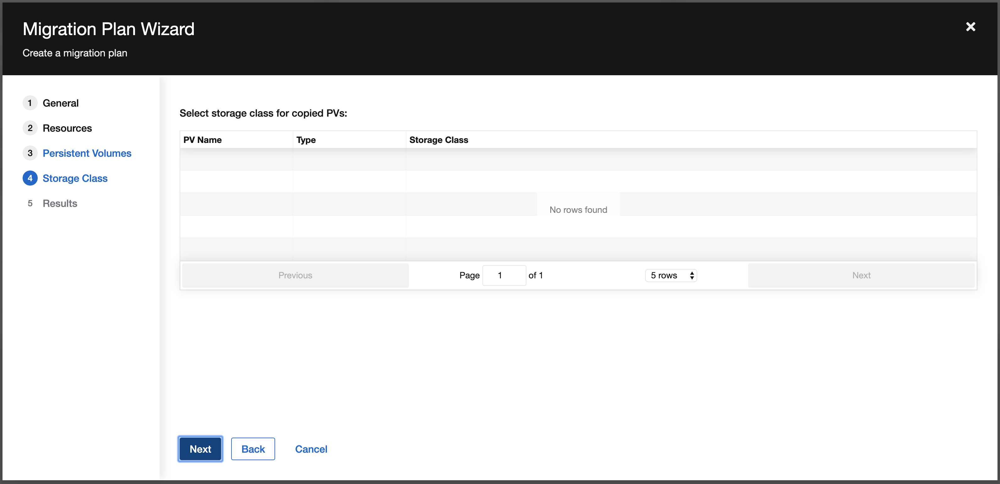

Since all our PVs are being `moved`, so destination storage classes need to be specified.  Click Next.

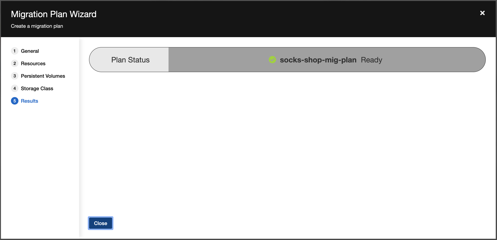

After validating the migration plan, you will see a `Ready` message and you can click `Close`.


### 6.3.1 Migrate the Application Workload

Now we can select `Migrate` or `Stage` on the application. Since we have chosen to `move` our four PVs, we will click on `Migrate`.  *Stage will skip any PVs not using copy.*

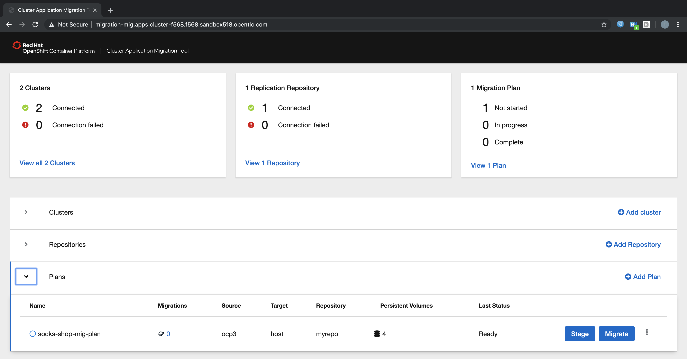

Optionally choose to *not* terminate the application on the source cluster.
Leave it unchecked and select `Migrate`.

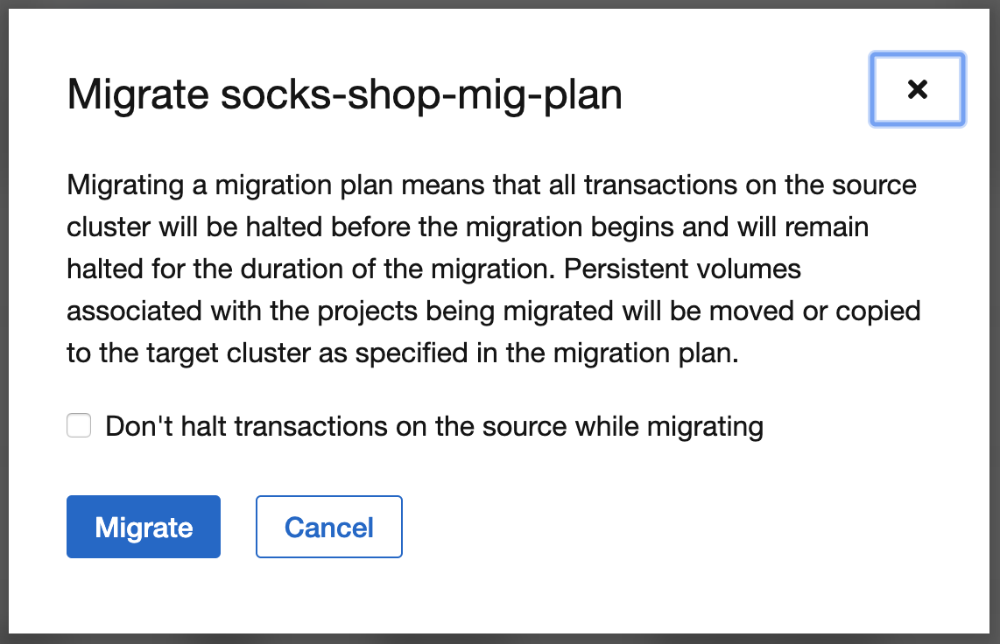

The migration will progress with a progress bar showing each step in the process.

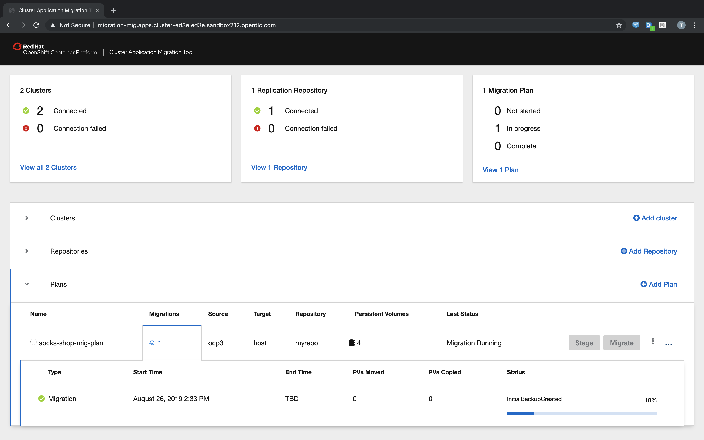

Once done, you should see `Migration Succeeded` on the migration plan.

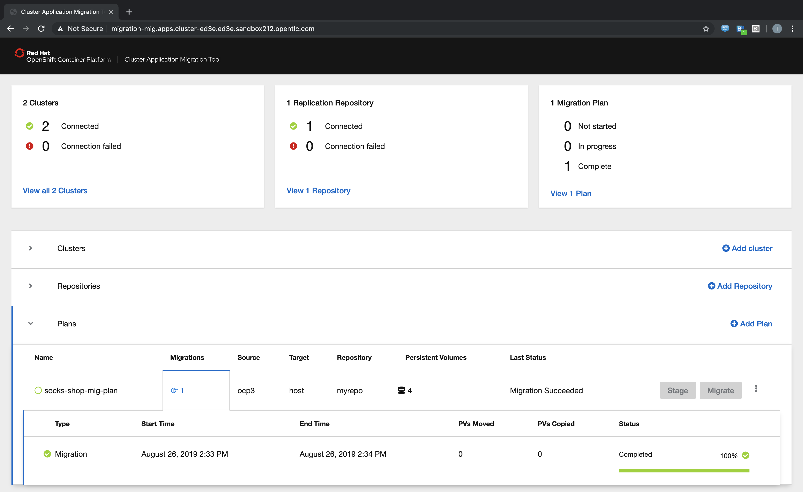


### 6.3.2 Verify application is functioning on Destination Cluster

Let's first open the OCP 4.1 web console and open the `sock-shop` namespace.

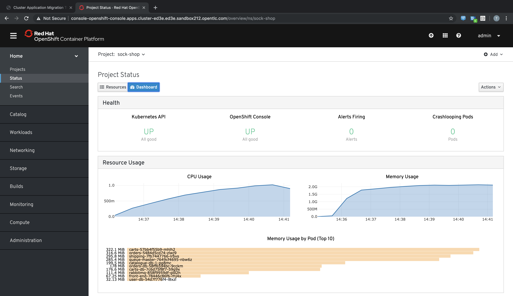

Click on the Storage > PVCs to see the persistent volume claims for the application.

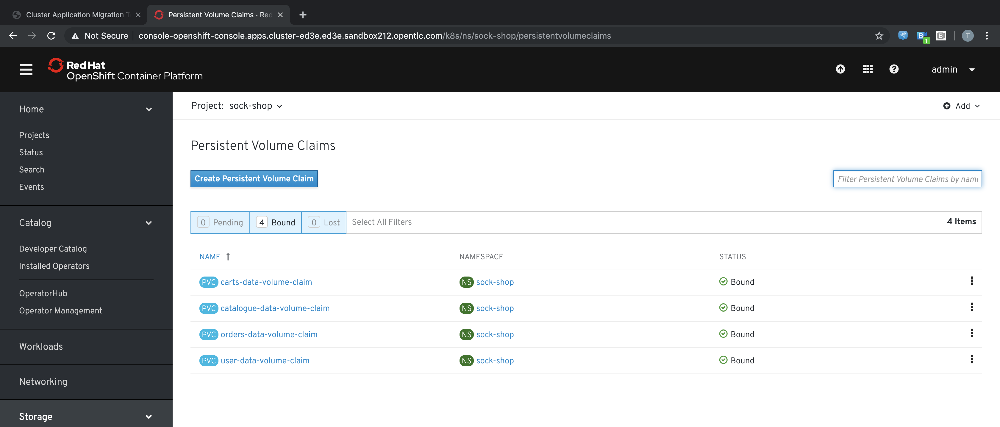

Drilling down into one of the PVs, we can verify that the underlying storage is the NFS server instance running on our OCP3 cluster.  This verifies that our PVs were indeed remapped via `move`.

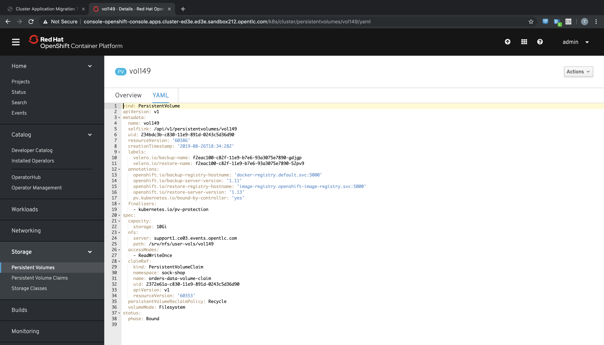


**Great job**, you have now successfully migrated two applications to your target cluster!

However, what happens when things don't go as planned?  In the next lab, we will examine some techniques for debugging failed migrations.

Next Lab: [Lab 7 - Debugging Failed Migrations](./7.md)<br>
Previous Lab: [Lab 5 - Migrate MSSQL Application](./5.md)<br>
[Home](./README.md)
