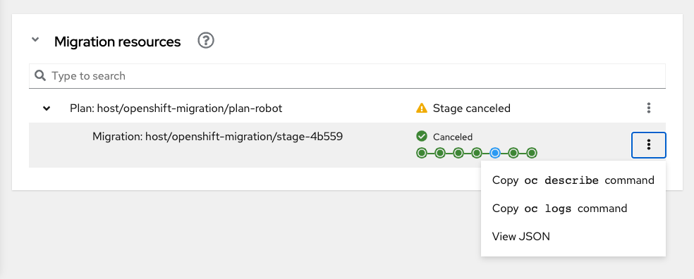
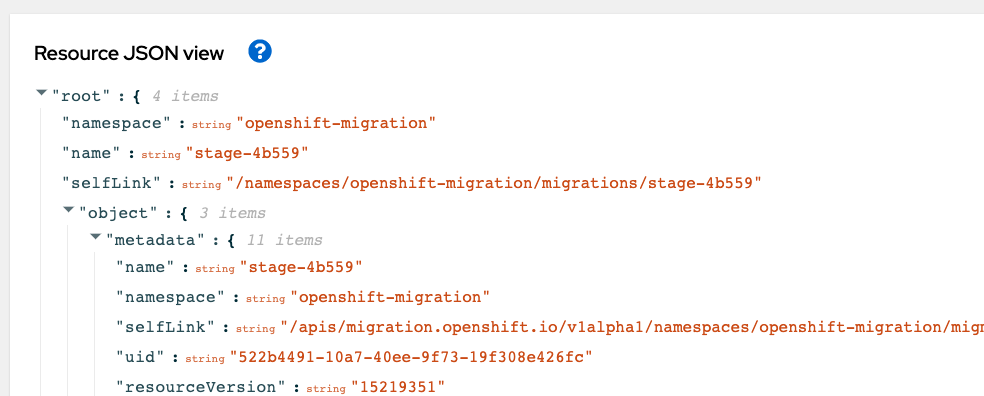

# Migration Debug View

The debug view in the migration web UI serves as a useful tool for speeding up investigations of failed migrations, or just for observing migration progress on a resource level. 

_With the debug view you can:_
 - Get a live view of a migration in progress and its associated resources.
 - Quickly discover the resource responsible for migration failure or warning.
 - Get pointers to resource JSON, relevant events, and logs to help you troubleshoot further.

## Accessing the Debug View

Once you've started a migration, you can access the debug view from the migration web UI (mig-ui). 

1. Click _Migration plans_ in the sidebar
2. Drill down to the _Migrations_ page for your plan of interest.
3. Drill down to the _Migration details_ for your migration of interest.
4. On the _Migration details_ page, expand the _Migration resources_ section of the page.

You should now be viewing the live tree view for the currently selected migration. As the migration runs, the tree will reflect migration activity.

## Troubleshooting a Migration with the Debug View

In the tree view, look for resources with **Warning** or **Failed** state. You should be able to understand which elements of the migration had problems at a glance.

If you see a resource of interest, you can view the logs, JSON, and associated events using the buttons in the kebab menu.

### Tips for Troubleshooting

If something has gone wrong during your migration, the `MigMigration` resource often holds the high level reason for the failure, so consider starting by looking at the status there, and then observe the status of resources nested under the migration in the tree view.

If the migration is still running, the status information on the  _Migration details_ page will often give a tip of why the migration isn't able to proceed. Looking at this status, then at the tree view, will often make it clear what the problematic resource is.

### Learn more about resources marked with _Failed_ or _Warning_

Each resource in the debug tree view has a kebab button to its right which will have some combination of these buttons available:

- Copy `oc describe` command
	- Copies a CLI command that will get associated events and YAML for the chosen resource.

- Copy `oc logs` command
	- Copies a CLI command that will get associated logs for the chosen resource.

- View JSON
	- Open a browser resource JSON viewer for the chosen resource.

