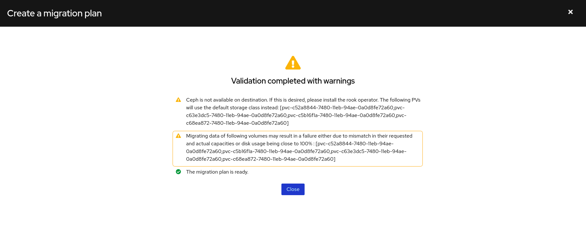
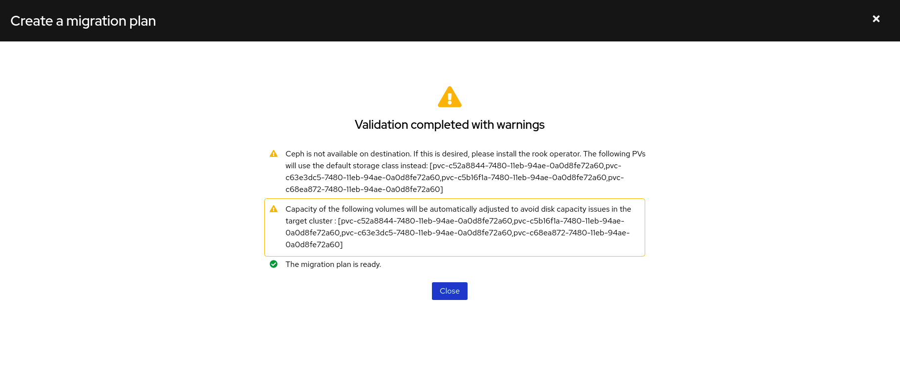

# Intelligent PV Resizing

When using Direct Volume Migration MTC 1.4.1 onwards, _Persistent Volumes_ that meet criteria described in [this section](#criteria) can be automatically resized in the target cluster to avoid volume capacity issues during migration.  Prior to 1.4.1, Direct Volume Migration determined capacity of restored PVC by reading the requested capacity of the PVC in the source cluster. However, requested capacity in the _Persistent Volume Claim_ isn't necessarily same as the actual provisioned capacity of the volume. For instance, when using GlusterFS (OCS 3) on OpenShift 3.11, if a user requests a volume of capacity `100M`, the dynamic provisioner will provision a volume of capacity `1G` instead. The users may not notice it and continue to use the volume beyond its original `100M` of capacity. If such a volume is restored in an environment which supports provisioning `100M` volume (for example, CephFS on OpenShift 4.6), the data transfer will fail due to insufficient disk space in the target cluster. To address these issues, MTC 1.4.1 allows resizing such _Persistent Volumes_ in the target cluster. Apart from the requested capacity in the PVC, it attempts to discover other properties of the volumes including actual provisioned capacity and disk usage. It uses this information to intelligently determine capacity of the volume required in the target cluster.

## Enable the feature

In MTC 1.4.1, this feature is limited to API users and is disabled by default. Whenever MTC determines that any of the volumes require automatic adjustment for migration to succeed, it will generate a _Warning_ on _MigPlan_ validation page in Mig UI:



The feature can be enabled by setting a flag in _MigrationController_ CR:

```yml
apiVersion: migration.openshift.io/v1alpha1
kind: MigrationController
metadata:
  name: migration-controller
  namespace: openshift-migration
spec:
  [...]
  enable_dvm_pv_resizing: true
```

Once the flag is propagated into the migration controller pod through a manual restart, MTC will enable the feature for all future migrations. The _Warning_ on MigPlan wizard will then change to indicate that the PVs will be resized automatically:



To disable, same process can be repeated by unsetting the flag:

```yml
apiVersion: migration.openshift.io/v1alpha1
kind: MigrationController
metadata:
  name: migration-controller
  namespace: openshift-migration
spec:
  [...]
  enable_dvm_pv_resizing: false
```

## Criteria

MTC uses following criteria to calculate resulting PVC capacity in the target cluster:

1. If requested storage capacity (`spec.resources.requests.storage`) of a PVC in its source cluster is not equal to its actual provisioned capacity (`status.capacity.storage`), maximum of both values is used as resulting capacity.

2. If a PV originally provisioned through a PVC is altered using ad-hoc storage utilities (e.g. Gluster CLI) making capacities in PVC and the PV mismatch, maximum of both capacities is used as resulting capacity.  

3. If disk usage of the volume is more than 97%, an extra headroom of 3% is added to the original usage percentage.
