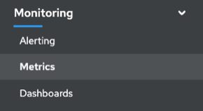
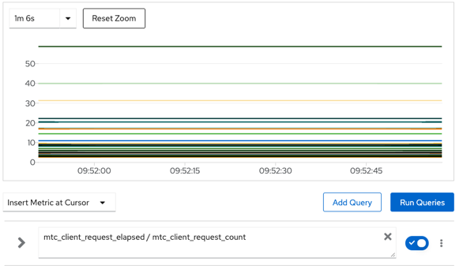

# Accessing mig-controller prometheus metrics

mig-controller records a set of metrics that may be useful in diagnosing migration performance issues. All metrics reset when the mig-controller manager container restarts. Metrics are pulled into on-cluster monitoring storage for querying via PromQL.

## Provided Metrics

### cam_app_workload_migrations

Count of MigMigration CRs over time. Useful for viewing alongside "mtc_client..." metrics to collate API request info with migration status changes. Included in Telemetry.

|   Queryable Label Name  |   Sample Label Values  |   Label Description  |
|-|-|-|
|   status  |   running, idle, failed, completed  |   Status of MigMigration CR  |
|   type  |   stage, final  |   Type of MigMigration CR  |

### mtc_client_request_count

Cumulative count of k8s API requests issued from mig-controller. Not included in Telemetry.

|   Queryable Label Name  |   Sample Label Values(s)  |   Label Description  |
|-|-|-|
|   cluster  |   https://migcluster-url:443  |   Cluster request was issued against  |
|   component  |   migplan, migcluster, ...  |   Sub-controller API request was issued from  |
|   function  |   (*ReconcileMigPlan).Reconcile"  |   Function request was issued from  |
|   kind  |   SecretList, Deployment, ...  |   K8s kind request was issued for  |

### mtc_client_request_elapsed

Cumulative milliseconds latency for k8s API requests issued from mig-controller. Not included in Telemetry.

|   Queryable Label Name  |   Sample Label Value(s)  |   Label Description  |
|-|-|-|
|   cluster  |   https://migcluster-url:443  |   Cluster request was issued against  |
|   component  |   migplan, migcluster, ...  |   Sub-controller API request was issued from  |
|   function  |   (*ReconcileMigPlan).Reconcile"  |   Function request was issued from  |
|   kind  |   SecretList, Deployment, ...  |   K8s kind request was issued for  |

## Accessing Metrics in the OpenShift 4 Monitoring UI

From the OpenShift 4 Web Console, select the sidebar menu item Monitoring > Metrics.

You can enter PromQL queries and select a time window to display.

If your web browser is having trouble displaying all of the metrics results, using the Prometheus UI directly can provide a more responsive experience.

## Useful queries

|   Query  |   Description  |
|-|-|
|   `mtc_client_request_count`  |   Shows number of API requests issued, binned by request type  |
|   `sum(mtc_client_request_count)`  |   Shows total number of API requests issued  |
|   `mtc_client_request_elapsed`  |   Shows API request latency, binned by request type  |
|   `sum(mtc_client_request_elapsed)`  |   Shows sum of API request latency  |
|   `mtc_client_request_elapsed / mtc_client_request_count`  |   Shows average latency of API requests, binned by request type  |
|   `sum(mtc_client_request_elapsed) / sum(mtc_client_request_count)`  |   Shows average latency of API requests overall  |
|   `cam_app_workload_migrations{status="running"} * 100`  |   Shows count of running migrations, scaled up (100x) for easier viewing alongside request counts  |
