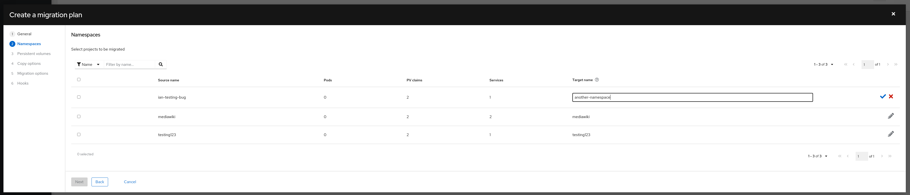

# Namespace mapping

Users can now use the api or UI to map a selected namespace to a new namespace name on the target cluster.

_Within the namespaces step in the plan wizard, you can now:_

- Add or edit an existing mapping for a namespace name.

## Accessing the Debug View

Once you've created a migration plan, you can access the namespace mapping feature within the plan wizard on the namespaces step.

1. Click _Migration plans_ in the sidebar
2. Drill down to the _Migrations_ page for your plan of interest.
3. Click on the kebab to the right of the row to open the _Plan Wizard_.
4. On the _Namespaces_ step, click the pencil icon within the namespace row you'd like to create a mapping for.

When you are done, proceed to the end of the wizard to finalize mapping changes.

## Troubleshooting a Migration with the Debug View

When mapping a namespace, there are a few things to keep in mind. We are not actively checking the target cluster for duplicate namespaces. If you have a pre-existing namespace on the target cluster with a conflicting name in your selected namespaces list, this may cause issues. In the UI, we only check for duplicate mappings against a) the list of src cluster namespaces and b) the list of mappings created thus far during the creation or editing process of a Migration Plan.

Ui form level validation is currently present to warn the user when a mapping discrepancy has occurred. When creating a mapping via a YAML editor, you may run into some issues if a ns is accidentally duplicated.
