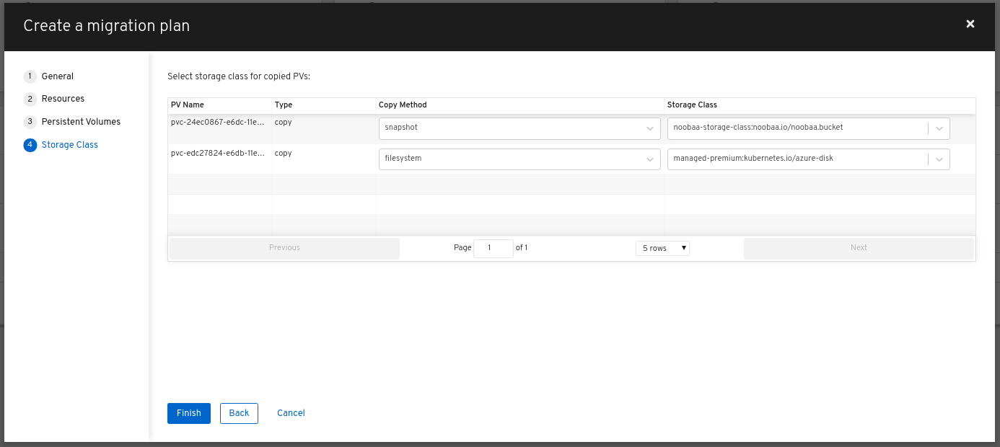

## Creating a migration plan in the CAM web console
You can create a migration plan in the CAM web console.

### Prerequisites
The CAM web console must contain the following:
* Source cluster
* Target cluster, which is added automatically during the CAM tool installation
* Replication repository

### Procedure
1. Log in to the CAM web console.
1. In the **Plans** section, click **Add plan**.
1. Enter the **Plan name** and click **Next**.
    * The **Plan name** can contain up to 253 lower-case alphanumeric characters (`a-z`, `0-9`). It must not contain spaces or underscores (`_`).
1. Select a **Source cluster**.
1. Select a **Target cluster**.
1. Select a **Replication repository**.
1. Select the projects to be migrated and click **Next**.
1. Select **Copy** or **Move** for the PVs:
    * **Copy** copies the data in a source cluster’s PV to the replication repository and then restores it on a newly created PV, with similar characteristics, in the target cluster.
    * **Move** unmounts a remote volume (for example, NFS) from the source cluster, creates a PV resource on the target cluster pointing to the remote volume, and then mounts the remote volume on the target cluster. Applications running on the target cluster use the same remote volume that the source cluster was using. The remote volume must be accessible to the source and target clusters.
1. Click **Next**.
1. Select a **Storage class** for the PVs.
    * You can change the storage class during migration, for example, from Red Hat Gluster Storage or NFS storage to Red Hat Ceph Storage.
1. (**Optional**) Select **snapshot** or **filesystem** for the PVs
    * Select **snapshot** only if you have read the [snapshot documentation](./Snapshot.md)
    * 
1. Click **Next**.
1. Click **Close**.

The migration plan appears in the Plans section.

---
[Home](./README.md)
