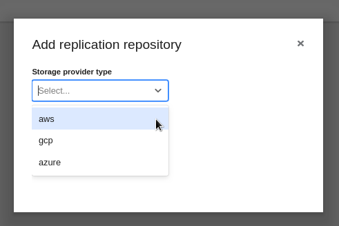
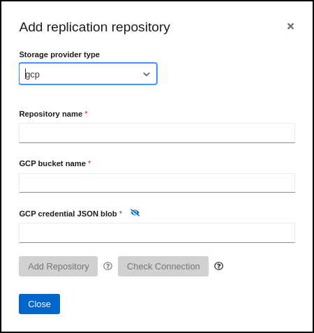
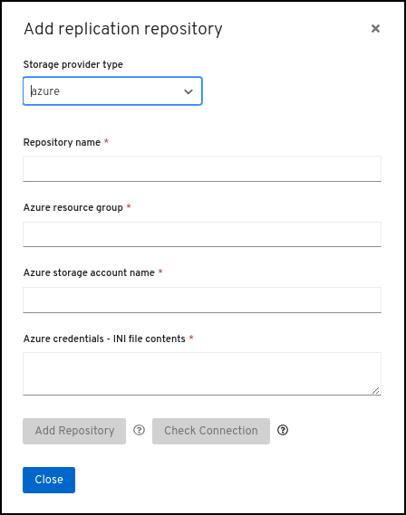

## Replication Repository Setup

Part of the Migration workflow in the CAM UI is creation of a *Replication Repository*. Configuring a Replication Repository gives CAM the information it needs to enable:

- *Object Storage* for temporary migration artifacts
  - S3 Bucket
  - GCP Bucket
  - Azure Blob Storage

- *Disk Snapshot* to take advantage of the *snapshot* functionality offered by Cloud Provider Storage providers
  - EBS Volume
  - GCP Volume
  - Azure Disk

## Replication Repository - Configurations per Cloud Provider

After clicking the "Add" Replication Repository button in the CAM UI, you'll first choose which Cloud Provider should be used for storage and snapshots.

## AWS Configuration

For AWS, the following configuration options are exposed:

- **Replication repository name**
  - Name for this replication repository in the CAM UI
- **S3 bucket name**
  - Name of the S3 bucket available at the S3 endpoint provided that should be used for storage
- **S3 bucket region**
  - Region of S3 bucket, if applicable. Required for AWS S3. Self-hosted S3 may not have a region
- **S3 endpoint**
  - Custom S3 endpoint. Required for non AWS S3 stores
- **S3 provider access key**
  - Access Key credential for authenticating access to S3 bucket
- **S3 provider secret access key**
  - Secret Key credential for authenticating access to S3 bucket
  - Refer to [ObjectStorage.md](./ObjectStorage.md) for details on obtaining this value

## GCP Configuration

For GCP, the following configuration options are exposed:

- **Repository name**
  - Name for this replication repository in the CAM UI
- **GCP bucket name**
  - Name of GCP bucket that should be used for storage
- **GCP credential JSON blob**
  - JSON blob for authenticating access to GCP bucket
  - Refer to [ObjectStorage.md](./ObjectStorage.md) for details on obtaining this value

## Azure Configuration

For Azure, the following configuration options are exposed:

- **Repository name**
  - Name for this replication repository in the CAM UI
- **Azure resource group**
  - Resource Group of Azure Blob Storage Container to be used
- **Azure storage account name**
  - Storage Account name containing Azure Blob Storage Container
- **Azure credentials - INI file contents**
  - INI blob for authenticating access to Azure Blob Storage Container
  - Refer to [ObjectStorage.md](./ObjectStorage.md) for details on obtaining this value
