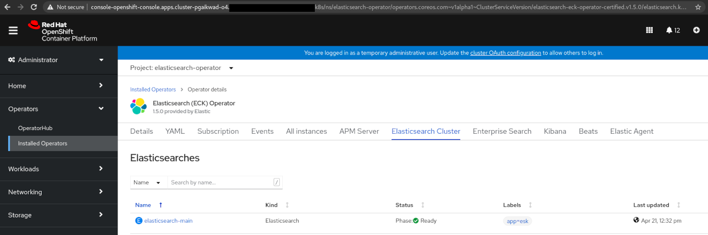

# Migrating application state using MTC

Direct Volume Migration (DVM) and Direct Image Migration (DIM) in MTC enable users to migrate stateful components of their workloads including Persistent Volumes and internal images provided that there is a direction between the source and the target clusters. As of MTC 1.4.3, The users can create a _MigPlan_ for their namespaces and opt for Direct Migration to use DVM and DIM for the migration. The users can then perform a _Stage_ or/and a _Final_ migration to migrate their workloads. There are scenarios where the users may have a CI/CD pipeline to manage the deployment of stateless Kubernetes Objects across different clusters. In such cases, users may wish to use MTC to migrate the state of the applications alone as the migration of Kubernetes Objects can be handled by such external mechanisms.

The typical migration workflows offered by MTC are not designed for the use case of migrating application states alone. However, the components of Direct Volume Migration (DVM) and Direct Image Migration (DIM) are designed in a way that they are still capable of migrating stateful components by either performing a _Stage_ migration with DVM & DIM enabled or by running DVM & DIM exclusively. In this document, we provide ways to accomplish such a migration with MTC, which we refer to as a _State Only Migration_.

## What is a State Only Migration?

We define a State Only Migration as a migration of stateful components of the workloads primarily including Persistent Volume Data, and internal images. In some cases, part of the application state may also be stored in the Kubernetes objects themselves. For instance, a Kubernetes Operator which creates login credentials for the users upon startup and stores them in a Kubernetes Secret is an example of application which stores their state in k8s objects. MTC cannot discover the state stored in such cases automatically, the users are expected to know if their application's state is stored in Kubernetes objects and use MTC's include/exclude capabilities to selectively migrate such components apart from Persistent Volumes or images.

## Examples

In this section, we discuss two examples of State Only migrations we performed using MTC 1.4.3. One of the applications is deployed using an external GitOps mechanism offered by ArgoCD, while the other one is deployed using OperatorHub. We will skip the details of ArgoCD & OperatorHub to keep the document concise. For more details on the specifics about ArgoCD deployment, check out our [Demo Apps](https://github.com/konveyor/mig-demo-apps/tree/master/gitops/) repository. Wherever MTC is used, we will also skip the details of pre-requisite steps for migration such as setting up _MigClusters_ and a _Replication Repository_, creating a _MigPlan_ for the namespace we are migrating, etc. The goal is to briefly explain workflows that users can adapt to leverage MTC for State Only Migrations.


## Example 1: Migrating state of File Uploader application

In this example, we deployed [File Uploader](https://github.com/konveyor/mig-demo-apps/tree/master/gitops/file-uploader) application on an OpenShift 3.11.272 cluster using ArgoCD. To create dummy data in the application, we uploaded some files in the application running on the source cluster:


We also verified that the uploaded files `cute-cat-1.jpg, cute-cat-2.jpg, cute-cat-3.jpg` are present in the _Persistent Volume_ in the app's namespace: 

```sh
[user@dragonfly ~]$ oc project file-uploader
Already on project "file-uploader" on server "https://master1.<redacted>:443".

[user@dragonfly ~]$ oc get pods
NAME                    READY   STATUS      RESTARTS   AGE
file-uploader-1-build   0/1     Completed   0          20m
file-uploader-1-stxsq   1/1     Running     0          19m
file-uploader-1-vtj6b   1/1     Running     0          19m
file-uploader-1-wb2rc   1/1     Running     0          19m

[user@dragonfly ~]$ oc exec -it file-uploader-1-vtj6b /bin/bash

bash-4.2$ df -h
Filesystem                                          Size  Used Avail Use% Mounted on
overlay                                              50G   16G   35G  31% /
tmpfs                                               7.8G     0  7.8G   0% /dev
tmpfs                                               7.8G     0  7.8G   0% /sys/fs/cgroup
/dev/xvda2                                           50G   16G   35G  31% /etc/hosts
shm                                                  64M     0   64M   0% /dev/shm
192.168.0.170:vol_fb93814026ccca0eb558d0cd1af928bd   20G  239M   20G   2% /opt/app-root/src/uploaded
tmpfs                                               7.8G   16K  7.8G   1% /run/secrets/kubernetes.io/serviceaccount
tmpfs                                               7.8G     0  7.8G   0% /proc/acpi
tmpfs                                               7.8G     0  7.8G   0% /proc/scsi
tmpfs                                               7.8G     0  7.8G   0% /sys/firmware

bash-4.2$ ls /opt/app-root/src/uploaded/ -l
-rw-r--r--. 1 1000500000 2015 56803 Apr 19 19:30 cute-cat-1.jpg
-rw-r--r--. 1 1000500000 2015 79359 Apr 19 19:30 cute-cat-2.jpg
-rw-r--r--. 1 1000500000 2015 58747 Apr 19 19:30 cute-cat-3.jpg
```

We migrated this app to the target cluster running OpenShift 4.7.3. The state of this application (uploaded files) is stored in Persistent Volumes. It also creates an Image Stream based on a PHP:7.1 image present in `openshift` namespace. We used MTC to migrate PV data and the images, and used ArgoCD to migrate the YAML definitions of Kubernetes objects. The verification criteria was to make sure that the app runs without issues on the target cluster and also shows all the files that we uploaded in the source cluster.

### Step 1: Running a Stage migration to migrate application state

As discussed in the introduction we already deployed this app on the Source cluster, and created dummy data. We created a MigPlan for this namespace and opted for Direct Migrations for both Images and the Persistent Volumes: 


Then we used MTC's _Stage_ migration capabilities to migrate application state. The _Stage_ migration is responsible for migrating Persistent Volumes and Images which is really the application state in this case:


We verified that the _Persistent Volumes_ and the internally generated _Images_ were migrated to the target cluster successfully:

```sh
[user@dragonfly ~]$ oc project file-uploader
Already on project "file-uploader" on server "https://api.<redacted>:6443".

[user@dragonfly ~]$ oc get pvc,imagestreams
NAME                                            STATUS   VOLUME                                     CAPACITY   ACCESS MODES   STORAGECLASS                AGE
persistentvolumeclaim/file-uploader-vol-claim   Bound    pvc-acfc90bd-89e0-484c-84e3-690986c1abcb   20Gi       RWX            ocs-storagecluster-cephfs   8m20s

NAME                                           IMAGE REPOSITORY                                                                                                          TAGS     UPDATED
imagestream.image.openshift.io/file-uploader   default-route-openshift-image-registry.apps.cluster-pgaikwad-o4.pgaikwad-o4.mg.dog8code.com/file-uploader/file-uploader   latest   7 minutes ago
```

### Step 2: Deploying the application on the target cluster using ArgoCD

Once we successfully migrated the stateful components, we used ArgoCD to create the YAML definitions of the application on the target cluster:


### Step 3: Verification

Once the YAML definitions were applied, we verified whether the application works on the target cluster without issues:


We also verified whether the files we uploaded in the source cluster were present in the target cluster as well:

```sh
[user@dragonfly ~]$ oc project file-uploader
Already on project "file-uploader" on server "https://api.<redacted>:6443".

[user@dragonfly ~]$ oc get pods
NAME                     READY   STATUS      RESTARTS   AGE
file-uploader-1-8fnc6    1/1     Running     0          3m16s
file-uploader-1-deploy   0/1     Completed   0          3m19s
file-uploader-1-w42vt    1/1     Running     0          3m16s
file-uploader-1-wpz6p    1/1     Running     0          3m16s

[user@dragonfly ~]$ oc exec -it file-uploader-1-w42vt /bin/bash

bash-4.2$ df -h
Filesystem                                                                                                                                                 Size  Used Avail Use% Mounted on
overlay                                                                                                                                                    120G   27G   93G  23% /
tmpfs                                                                                                                                                       64M     0   64M   0% /dev
tmpfs                                                                                                                                                      7.9G     0  7.9G   0% /sys/fs/cgroup
shm                                                                                                                                                         64M     0   64M   0% /dev/shm
tmpfs                                                                                                                                                      7.9G   67M  7.8G   1% /etc/passwd
/dev/xvda4                                                                                                                                                 120G   27G   93G  23% /etc/hosts
172.30.141.223:6789,172.30.252.124:6789,172.30.209.63:6789:/volumes/csi/csi-vol-6d0c5d48-a148-11eb-b163-0a580a810282/830882b1-199c-4f22-8895-510294cab289   20G     0   20G   0% /opt/app-root/src/uploaded
tmpfs                                                                                                                                                      7.9G   28K  7.9G   1% /run/secrets/kubernetes.io/serviceaccount
tmpfs                                                                                                                                                      7.9G     0  7.9G   0% /proc/acpi
tmpfs                                                                                                                                                      7.9G     0  7.9G   0% /proc/scsi
tmpfs                                                                                                                                                      7.9G     0  7.9G   0% /sys/firmware

bash-4.2$ ls /opt/app-root/src/uploaded -ltr
total 191
-rw-r--r--. 1 1000500000 2015 56803 Apr 19 19:30 cute-cat-1.jpg
-rw-r--r--. 1 1000500000 2015 79359 Apr 19 19:30 cute-cat-2.jpg
-rw-r--r--. 1 1000500000 2015 58747 Apr 19 19:30 cute-cat-3.jpg
```

## Example 2: Migrating state of Elasticsearch Operator

In this example, we deployed an [Elasticsearch Operator](https://operatorhub.io/operator/elastic-cloud-eck) through OperatorHub on the source cluster running OpenShift 4.7.3. We created instances of custom resources _Elasticsearch_ and _Kibana_ to deploy a basic Elasticseach cluster with Kibana in the operator's namespace:





We also created sample data in the Elasticsearch cluster by using a demo dataset available online: 


The operator stores most of the cluster's state in Persistent Volumes, while it also uses Kubernetes Secrets to store information about users, TLS certs among others. 

```sh
[user@dragonfly ~]$ oc project elasticsearch-operator
Using project "elasticsearch-operator" on server "https://api.cluster-pgaikwad-o4.<redacted>:6443".

[user@dragonfly ~]$ oc get pvc
NAME                                                 STATUS   VOLUME                                     CAPACITY   ACCESS MODES   STORAGECLASS   AGE
elasticsearch-data-elasticsearch-main-es-default-0   Bound    pvc-7d56cd28-5281-494a-ac20-1c11944fe349   1Gi        RWO            gp2            9m46s
elasticsearch-data-elasticsearch-main-es-default-1   Bound    pvc-7e53d908-9586-4ef3-b5c8-1e2df1c19b13   1Gi        RWO            gp2            9m46s
elasticsearch-data-elasticsearch-main-es-default-2   Bound    pvc-1b73ba99-c4d6-486c-92a4-032f627f6927   1Gi        RWO            gp2            9m45s

[user@dragonfly ~]$ oc get secret elasticsearch-main-es-remote-ca kibana-main-kb-es-ca kibana-main-kibana-user elasticsearch-main-es-http-certs-public
NAME                                      TYPE     DATA   AGE
elasticsearch-main-es-remote-ca           Opaque   1      8m31s
kibana-main-kb-es-ca                      Opaque   2      83s
kibana-main-kibana-user                   Opaque   1      83s
elasticsearch-main-es-http-certs-public   Opaque   2      8m32s
```

We migrated this operator using MTC to a target OpenShift 4.7.3 cluster. The goal was to demonstrate how MTC can be used to migrate state of such an application using a mix of _Final_ migration and _Direct Volume Migration_. The verification criteria was to make sure that the Kibana works with the same password in the target cluster and the indexes we created in the source cluster are present in the target after migration. 

### Step 1: Migrating Secrets and Configmaps using MTC

As explained in the previous section, the operator stores user and the TLS certificate information in Secrets along with some other information stored in Configmaps. We used `excluded_resources` variable in _MigrationController_ CR to configure MTC to only migrate Secrets, Configmaps and the custom resources for _Elasticsearch_ and _Kibana_. We added all other resources in the excluded list:

```
excluded_resources: imagetags,templateinstances,clusterserviceversions,packagemanifests,subscriptions,servicebrokers,servicebindings,serviceclasses,serviceinstances,serviceplans,s,persistentvolumeclaims,persistentvolumes,imagestreams,pods,statefulsets,replicasets,deployments
```

See the [documentation](https://github.com/konveyor/mig-operator/blob/master/docs/usage/ExcludeResources.md)  for more details.

This configuration allowed us to migrate Secrets and Configmaps in which the Elasticsearch Operator stored its state in the source cluster. Then, we created a _MigPlan_ for `elasticsearch-operator` namespace and performed a _Final_ migration to migrate the Kubernetes resources:


We verified that the Secrets were migrated successfully:

```sh
[user@dragonfly ~]$ oc project
Using project "elasticsearch-operator" on server "https://api.cluster-pgaikwad-o4-2.<redacted>:6443".

[user@dragonfly ~]$ oc get secret elasticsearch-main-es-remote-ca kibana-main-kb-es-ca kibana-main-kibana-user elasticsearch-main-es-http-certs-public
NAME                                      TYPE     DATA   AGE
elasticsearch-main-es-remote-ca           Opaque   1      118m
kibana-main-kb-es-ca                      Opaque   2      118m
kibana-main-kibana-user                   Opaque   1      118m
elasticsearch-main-es-http-certs-public   Opaque   2      118m
```

### Step 2: Migrating Persistent Volume data

Once a _Final_ migration is performed, MTC does not allow running another migration with the same plan. However, as we established in the opening section, components of Direct Migrations are designed in a way that they can still be used independently. The Direct Volume Migration custom resource takes a list of Persistent Volumes, source and the target _MigClusters_ as inputs and migrates the Persistent Volume data whenever the Custom Resource is created in `openshift-migration` namespace. When a user selects Direct Volume Migration for PVs, MTC creates such a custom resource to enable the direct migration using DVM controller. 

But since we cannot use MTC to do that, we wrote an Ansible Playbook to create the spec for DVM's Custom Resource. The playbook takes list of namespaces, names of source and the target _MigClusters_ and storage class mappings as input and generates a DVM Custom Resource. See details of this playbook in [here](https://gist.github.com/pranavgaikwad/67ba10864c82e3750e3c1a1405d059ec).

We simply created this custom resource and waited until all the volumes were migrated:

```sh
apiVersion: migration.openshift.io/v1alpha1
kind: DirectVolumeMigration
metadata:
  [...]
  name: dvm-elasticsearch
  namespace: openshift-migration
spec:
  createDestinationNamespaces: true
  destMigClusterRef:
    name: 4-dot-7-cluster
    namespace: openshift-migration
  persistentVolumeClaims:
  - name: elasticsearch-data-elasticsearch-main-es-default-0
    namespace: elasticsearch-operator
    targetAccessModes:
    - ReadWriteOnce
    targetStorageClass: gp2
    verify: false
  - name: elasticsearch-data-elasticsearch-main-es-default-1
    namespace: elasticsearch-operator
    targetAccessModes:
    - ReadWriteOnce
    targetStorageClass: gp2
    verify: false
  - name: elasticsearch-data-elasticsearch-main-es-default-2
    namespace: elasticsearch-operator
    targetAccessModes:
    - ReadWriteOnce
    targetStorageClass: gp2
    verify: false
  srcMigClusterRef:
    name: host
    namespace: openshift-migration
status:
  conditions:
  - category: Advisory
    durable: true
    lastTransitionTime: "2021-04-21T17:33:01Z"
    message: The migration has succeeded
    reason: Completed
    status: "True"
    type: Succeeded
  itinerary: VolumeMigration
  observedDigest: 6729873d811f8dfe3aa850889d121ab2724a300eca35dacfcc2b6839859c13ee
  phase: Completed
  phaseDescription: Complete
  rsyncOperations:
  - currentAttempt: 1
    pvcReference:
      name: elasticsearch-data-elasticsearch-main-es-default-0
      namespace: elasticsearch-operator
    succeeded: true
  - currentAttempt: 1
    pvcReference:
      name: elasticsearch-data-elasticsearch-main-es-default-1
      namespace: elasticsearch-operator
    succeeded: true
  - currentAttempt: 1
    pvcReference:
      name: elasticsearch-data-elasticsearch-main-es-default-2
      namespace: elasticsearch-operator
    succeeded: true
  startTimestamp: "2021-04-21T17:31:37Z"
  successfulPods:
  - lastObservedProgressPercent: 100%
    name: dvm-rsync-4p5t8
    namespace: elasticsearch-operator
    pvcRef:
      name: elasticsearch-data-elasticsearch-main-es-default-0
      namespace: elasticsearch-operator
    totalElapsedTime: 0s
  - lastObservedProgressPercent: 100%
    name: dvm-rsync-c6gb2
    namespace: elasticsearch-operator
    pvcRef:
      name: elasticsearch-data-elasticsearch-main-es-default-1
      namespace: elasticsearch-operator
    totalElapsedTime: 1s
  - lastObservedProgressPercent: 100%
    name: dvm-rsync-dptkl
    namespace: elasticsearch-operator
    pvcRef:
      name: elasticsearch-data-elasticsearch-main-es-default-2
      namespace: elasticsearch-operator
    totalElapsedTime: 0s
```

### Step 3: Deploying the operator on the target cluster

Until this point, we had Secrets, Configmaps, Persistent Volumes, Elasticsearch and Kibana custom resources migrated successfully to the target cluster. Now we deployed the operator on the target cluster from OperatorHub. Since the Elasticsearch and Kibana custom resources were already present in the target namespace, the opeartor immediately reconciled them and setup the cluster exactly the way it was deployed on the source cluster.


### Step 4: Verification

We verified that the Kibana was able to use the user credentials stored in the Secret we migrated:

_User secret on source cluster_
```sh
[user@dragonfly ~]$ oc project
Using project "elasticsearch-operator" on server "https://api.cluster-pgaikwad-o4.<redacted>:6443".

[pranav@dragonfly ~]$ oc get secret elasticsearch-main-es-elastic-user -o=jsonpath='{.data.elastic}' | base64 --decode; echo
2O7XY15XZsejMrs78966GLJ1
```

_User secret on target cluster_
```sh
[user@dragonfly ~]$ oc project
Using project "elasticsearch-operator" on server "https://api.cluster-pgaikwad-o4-2.<redacted>:6443".

[user@dragonfly ~]$ oc get secret elasticsearch-main-es-elastic-user -o=jsonpath='{.data.elastic}' | base64 --decode; echo
2O7XY15XZsejMrs78966GLJ1
```

_Logging into target Kibana using user credentials_


We verified that the demo data we created on the source cluster was present in the target cluster:


#### Continue reading

See [State Transfer Usage](./StateTransferUsage.md) documentation to learn more about using State Transfer in MTC 1.6.0
