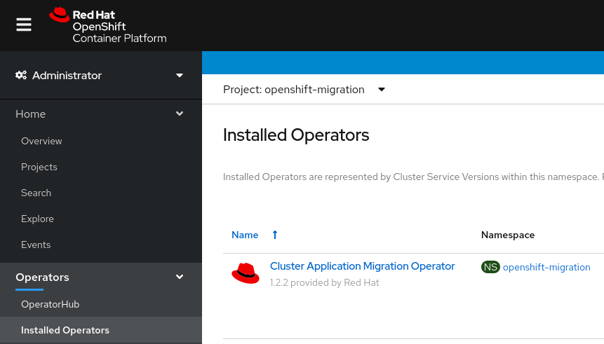
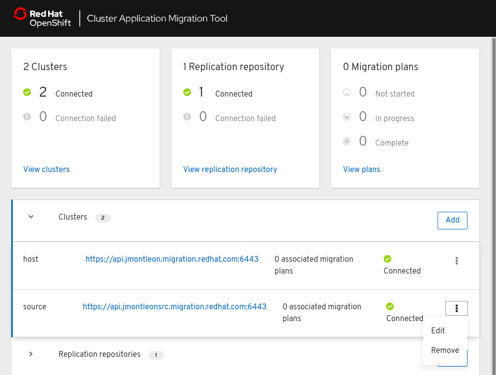
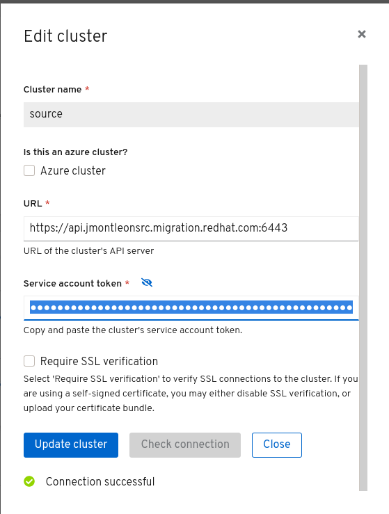

# Openshift 3
If you have previously installed a version of CAM upgrading is straight forward.

**Removing the namespace and recreating it will remove service accounts and will require updating the remote cluster credentials so this should be avoided.**

Instead, as an example, if you have previously installed version 1.2.1 and now wish to upgrade to 1.2.2 run:  
`oc replace -f deploy/non-olm/v1.2.2/operator.yml`

This will redeploy the new operator, which will in turn deploy the new operands.

# Openshift 4
If you chose `automatic` approvals for upgrades CAM will autoamtically update on a particular channel.

1. If you chose `manual` approvals or wish to switch channels navigate to `Operators>Installed Operators` on the left menu in the OpenShift console.

1. Click the `Cluster Application Migration Operator` link.
1. Choose `Subscription` from the top menu.

1. From this page you can switch channels or approve a pending update. Like with OpenShift 3 modifying the subscription will deploy the updated operator which will in turn deploy the updated operands.

# Removal of the `mig` service account in CAM 1.2
In CAM 1.2 the `mig` service account has been replaced with the `migration-controller` service account. When upgrading from 1.1.z to 1.2.z you should also update the remote cluster service account token.

1. On the source cluster run `oc sa get-token -n openshift-migration migration-controller`.
1. In the migration UI edit the remote cluster

1. Update the `Service account token` field with the new token.

1. Click `Update Cluster` and verify connectivity.

