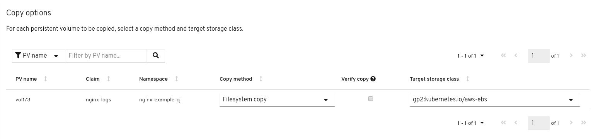
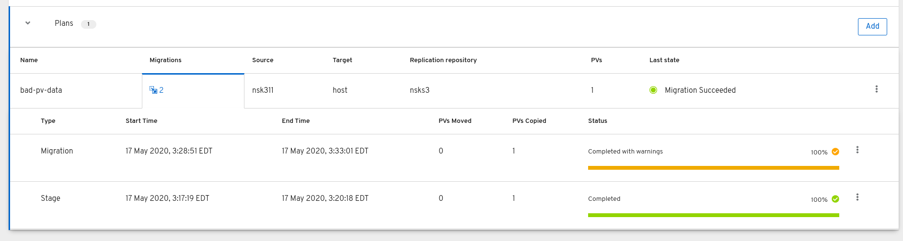

# Volume verification for volumes migrated via filesystem copy

CAM now supports file-level verification for persistent volumes
migrated via filesystem copy. This is implemented via the underlying
`--verify` restore flag supported by restic. For the moment, when
specifying `--verify` for a volume, incremental restore must be
disabled for that volume. This is handled internally by the velero
code which sets restic flags. The only user-level action required here
is to set `verify` to `true` for the volume.

## Selecting verify via the CAM API

In the `spec.persistentVolumes` section of the `migplan`, set
`selection.verify: true` for each PV that you want to verify. If
`selection.action` is not set to "copy" and `selection.copyMethod` is
not set to "filesystem" then this field is ignored.

```
spec:
  persistentVolumes:
  - capacity: 10Gi
    name: pvc-2ba60854-8b27-11ea-a10d-02e5ce94b826
    pvc:
      accessModes:
      - ReadWriteOnce
      name: mysql
      namespace: mysql-persistent
    selection:
      action: copy
      copyMethod: filesystem
      storageClass: gp2
      verify: true
    storageClass: gp2
    supported:
      actions:
      - copy
      - move
      copyMethods:
      - filesystem
      - snapshot
```

## Selecting verify via the CAM API

To enable volume verification via the UI, there is a checkbox that can be
checked on a per-volume basis for those that have been designated with the "copy"
action:



### Restic verify failure in the UI

When a Restic verify failure occurs, the migration will report a status of
"Complete with warnings":



## CAM API output for restic verify (and other errors)

If there are any restic verify errors on restore, the `migmigration`
will show a warning which will indicate that there were verify errors,
how many volumes had errors, and which velero Restore resource to look
at for more details.

```
status:
  conditions:
  - category: Warn
    durable: true
    lastTransitionTime: 2020-04-16T20:35:16Z
    message: There were verify errors found in 1 Restic volume restores. See restore `registry-example-migration-rvwcm`
      for details
    status: "True"
    type: ResticVerifyErrors
```

In addition, there will be a warning shown if there are any restic
restores with overall errors (including verify errors):

```
status:
  conditions:
  - category: Warn
    durable: true
    lastTransitionTime: 2020-04-16T20:35:16Z
    message: There were errors found in 1 Restic volume restores. See restore `registry-example-migration-rvwcm`
      for details
    status: "True"
    type: ResticErrors
```

Since verify errors are included in the overall error total, any time
there is a `ResticVerifyErrors` warning, there will also be a
`ResticErrors` warning. Non-verify errors will be reported whether or
not `verify` was set to "true" for a volume.

Neither category of restic errors will trigger a migration failure.

### Upstream velero symlink bug

One case where we expect to see `ResticErrors` reported for now is
when there are symlinks on the volume and there is a separate stage
migration prior to final migration (or two stage migrations
run). There's an upstream bug (already reported) where if a second
restic restore into the same volume attempts to overwrite an existing
symlink, an error is reported (and the symlink is not updated). In
cases where the symlink is unchanged from the stage migration, it's a
harmless error message. In the case where the symlink has changed, the
target volume will retain the older symlink.

## Tracking down restic errors

Once the migmigration warnings have been recorded, a user can go to
the target cluster's velero CRs for more information. Looking at the
referenced velero restore will show which volumes had errors:

```
status:
  phase: Completed
  podVolumeRestoreErrors:
  - kind: PodVolumeRestore
    name: registry-example-migration-rvwcm-98t49
    namespace: openshift-migration
  podVolumeRestoreResticErrors:
  - kind: PodVolumeRestore
    name: registry-example-migration-rvwcm-98t49
    namespace: openshift-migration
```

From here we have a reference to each PV-specific `PodVolumeRestore`
which logged restic errors. Looking at this resource will show how
many verify and overall errors were logged when restoring the volume
and which restic pod to pull logs from in order to see the actual
restic stderr output:

```
  completionTimestamp: 2020-05-01T20:49:12Z
  errors: 1
  resticErrors: 1
...
  resticPod: restic-nr2v5
```


